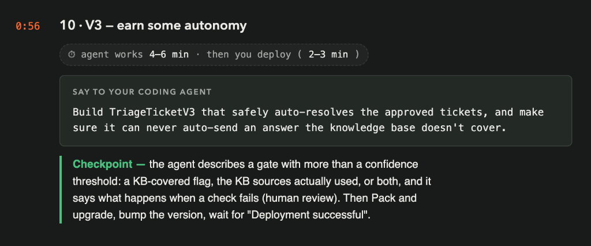
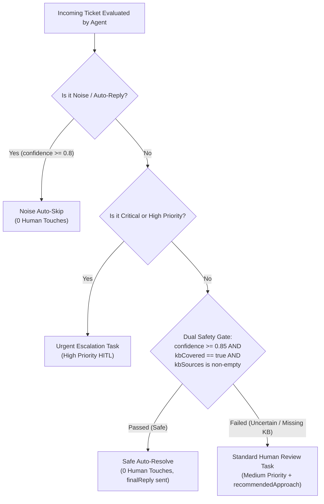
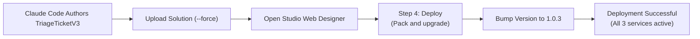
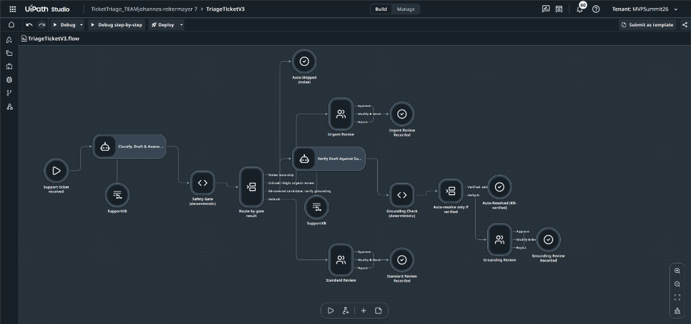
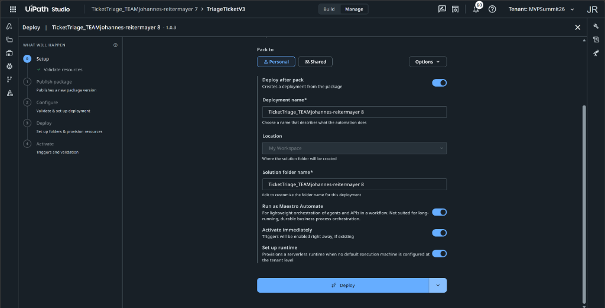
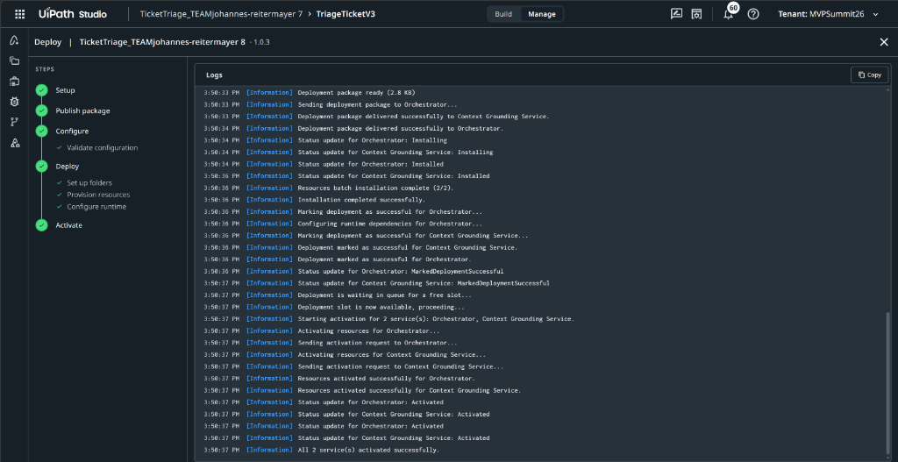

# Chapter 10: V3 - Earn Some Autonomy

> [!NOTE]
> **The Big Picture: Earning Safe Autonomy in V3**  
> In Chapter 7, you built V2 to isolate critical outages and discard obvious noise. In Chapter 9, you observed that your coding agent approved 4 out of 7 standard tickets as-is because they had clear, authoritative answers in SupportKB. Now, in Chapter 10, your system takes the next evolutionary leap in enterprise automation: earning autonomy. Instead of requiring human approval for every routine ticket, TriageTicketV3 introduces an automated resolution path. Crucially, autonomy is not granted based on a naive model confidence score alone. V3 introduces a rigorous knowledge grounding safety gate: a `kbCovered` flag and verified `kbSources`. If a ticket is routine, highly confident, and genuinely covered by enterprise documentation, it auto-resolves with zero human touches. If knowledge is missing, partial, or uncertain, the gate fails safe and routes the ticket to human review.

In this chapter, you instruct your AI coding agent (**Claude Code**) to design and author **`TriageTicketV3`** as a third flow inside your existing solution. V3 introduces safe, earned autonomy by combining LLM confidence with verifiable knowledge base grounding gates.



| Step | Action | Description / Deliverable |
| :--- | :--- | :--- |
| **1. Grounding Gate Design** | Architect Safety Gate | Define `kbCovered`, `kbSources`, and strict fallback logic |
| **2. Build V3 Flow** | Scaffold `TriageTicketV3` | Author the 4-way routing flow in the existing solution |
| **3. Validate & Upload** | Force Upload to Cloud | Validate `.flow` schema and upload with `--force` |
| **4. Pack & Upgrade** | Deploy in Studio Web | Execute "Pack and upgrade" in Studio Web designer to version `1.0.3` |
| **5. Verify Release** | CLI Registry Check | Confirm `TriageTicketV3` release is active in Orchestrator |

---

## 1. The Enterprise Autonomy Dilemma

One of the greatest hazards in enterprise AI automation is **premature autonomy**. Organizations often deploy workflows that auto-send replies based solely on a high confidence score (e.g. `confidence >= 0.85`).

### Why Confidence Scores Are Not Enough
1. **Hallucination Under High Confidence:** Large Language Models can generate plausible-sounding but entirely fabricated policies with high internal probability. A model might confidently state: *"Our policy permits up to $300 in personal card software purchases"*, even when no such policy exists.
2. **The Knowledge Void Hazard:** In Chapter 9, ticket `HF-2005` (Viktor Hansen asking about dual-boot Linux) received high model confidence, but the underlying knowledge base contained no runbook for disk partitioning. A naive auto-send rule would have emailed an unvetted answer directly to an employee.
3. **The Solution: Earned Autonomy via Dual Verification:**
   To earn autonomy in production, an agent must satisfy two independent criteria before bypassing a human reviewer:
   - **Criterion 1 (Statistical Confidence):** `confidence >= 0.85`.
   - **Criterion 2 (Deterministic Grounding):** `kbCovered == true` AND `kbSources` cites specific, valid documentation sections from `SupportKB`.



---

## 2. Architecture of `TriageTicketV3`

`TriageTicketV3` expands the decision-making engine into a robust **4-way routing architecture**:

### Evolution of the Agent Schema Across Generations

| Field | V1 Baseline | V2 Multi-Path | V3 Earned Autonomy | Purpose in V3 |
| :--- | :--- | :--- | :--- | :--- |
| `category` | Yes | Yes | Yes | Categorizes request (Software, Hardware, Finance, Noise, etc.) |
| `priority` | Yes | Yes | Yes | Assesses urgency (Critical, High, Medium, Low) |
| `confidence` | Yes | Yes | Yes | Statistical certainty score (0.0 to 1.0) |
| `draftReply` | Yes | Yes | Yes | Pre-composed email response |
| `rationale` | Yes | Yes | Yes | Internal explanation of triage choices |
| `recommendedApproach` | No | **Yes** | Yes | Step-by-step guidance for human reviewers |
| **`kbCovered`** | No | No | **NEW (Boolean)** | **Grounding flag:** `true` only if answer is directly in SupportKB |
| **`kbSources`** | No | No | **NEW (Array/String)** | **Citation audit:** Specific document titles or sections utilized |

---

### The Four Operational Paths in V3

1. **Path 1: Noise Branch (`AutoSkipped`):**
   - **Condition:** `category == 'Noise' && confidence >= 0.8`
   - **Action:** Terminates at End node immediately. Sets `decision = "AutoSkipped"`. 0 human touches.
2. **Path 2: Urgent Escalation Branch (`urgentReview`):**
   - **Condition:** `priority == 'Critical' || priority == 'High'`
   - **Action:** Creates a dedicated High-priority task in Action Center titled `"URGENT: Review Draft Reply (Critical/High impact)"`. Never auto-resolves critical outages.
3. **Path 3: Safe Auto-Resolve Branch (`AutoResolved`):**
   - **Condition:** `kbCovered == true && confidence >= 0.85 && priority != 'Critical' && priority != 'High' && category != 'Noise'`
   - **Action:** Automatically records `decision = "AutoResolved"`, populates `finalReply = draftReply`, and completes the run at the End node without creating an Action Center task.
4. **Path 4: Standard Review Fallback (`standardReview`):**
   - **Condition:** Default branch (taken whenever `kbCovered == false`, confidence is below threshold, or the query requires policy exception approval).
   - **Action:** Creates a standard Medium-priority task in Action Center with `recommendedApproach` populated.

---

## 3. The Chapter 10 Prompts

You can execute Chapter 10 using either the baseline prompt from Tuan's slide or the optimized context-rich prompt.

### Option 1: Baseline Prompt (From Tuan's Slide)
This is the prompt from Product Manager Tuan's slide:

```text
Build TriageTicketV3 that safely auto-resolves the approved tickets, and make sure it can never auto-send an answer the knowledge base doesn't cover.
```

### Option 2: Context-Rich Optimized Prompt (Recommended)
This version explicitly defines the safety gate parameters, output schema, routing rules, and cloud upload flags:

```text
Build TriageTicketV3 as a third flow in the solution "TicketTriage_TEAM<firstname>-<lastname>" based on our review findings from Chapter 9.

Follow these architectural requirements:
1. Agent Node Grounding & Schema:
   - Ground the agent node against SupportKB in the Shared folder.
   - Expand the agent output schema to include:
     - `kbCovered` (boolean): true only if the answer is directly and authoritatively supported by SupportKB; false if KB is silent, partial, or missing relevant runbooks.
     - `kbSources` (array of strings): specific article titles or policy sections cited.
     - `recommendedApproach` (string): actionable reviewer guidance.
2. Safe Autonomy Decision Switch:
   - Noise Branch: category == 'Noise' && confidence >= 0.8 -> route to End (decision: "AutoSkipped").
   - Urgent Branch: priority == 'Critical' || priority == 'High' -> route to urgentReview task (High priority).
   - Safe Auto-Resolve Branch: kbCovered == true && confidence >= 0.85 && priority != 'Critical' && priority != 'High' && category != 'Noise' -> route to End (decision: "AutoResolved", finalReply = draftReply).
   - Standard Review Fallback: Default path for any ticket failing the safety gate -> route to standardReview task (Medium priority) with recommendedApproach.
3. Validate and upload the solution using `uip solution upload . --force`.
4. Report back the completed safety gate design and confirm the project is ready for Studio Web deployment.
```

---

## 4. Behind the Scenes: Deploying V3 in Studio Web

Just like V2, newly authored flows must be compiled, packaged, and activated in Orchestrator through the **Studio Web browser designer**.



### Deployment Instructions in Studio Web
1. After your coding agent finishes authoring and uploading `TriageTicketV3`, open your browser tab with **Studio Web**.
2. Refresh the page to load the upgraded solution structure. You will see three projects listed: `TriageTicketV1`, `TriageTicketV2`, and `TriageTicketV3`. Open `TriageTicketV3` to inspect the 4-path canvas:



3. Click **Deploy** in the top navigation bar.
4. In Step 4 of the deployment wizard:
   - If prompted with a name collision on an existing folder, set the deployment and solution folder name to `TicketTriage_TEAM<firstname>-<lastname> 8`.
   - Verify the version bumps from `1.0.2` to **`1.0.3`**.



5. Click **Deploy** and monitor the activation log until all 5 steps complete with green checkmarks:



> [!WARNING]
> **Do Not Dispatch Jobs Early**  
> Just like in Chapter 7, if you attempt to run Batch C before Studio Web finishes activating the deployment, Orchestrator will have no active release for `TriageTicketV3`, and your run will fail with `No release found`. Always wait for the green notification.

---

## 5. Checkpoint & Verification

### 5.1 Checkpoint Criteria
Verify that your execution meets all official workshop criteria:
- **Safety Gate Described:** The agent explicitly articulates a multi-factor gate:
  - More than a raw confidence threshold.
  - A dedicated `kbCovered` flag and `kbSources` citation list.
  - Clear definition of what happens when the check fails (safe fallback to human review).
- **Solution Uploaded:** `uip solution upload . --force` succeeds without schema or handle errors.
- **Pack and Upgrade Deployed:** Studio Web reports version **`1.0.3`** deployed and all services active.
- **Orchestrator Processes Verified:** Querying `uip or processes list` reports all three processes at version `1.0.3`.

---

### 5.2 Verify Active Processes via CLI

Run the following command in PowerShell or Claude Code:

```powershell
uip or processes list --folder-key f19c7f55-614a-4d7e-9d9e-b1461b8f4e11 --output table
```

You should see all three processes active and pointing to version `1.0.3`:

```text
Name            ProcessKey                                                  ProcessVersion
----            ----------                                                  --------------
TriageTicketV1  TicketTriage_TEAMjohannes-reitermayer.7.flow.TriageTicketV1  1.0.3
TriageTicketV2  TicketTriage_TEAMjohannes-reitermayer.7.flow.TriageTicketV2  1.0.3
TriageTicketV3  TicketTriage_TEAMjohannes-reitermayer.7.flow.TriageTicketV3  1.0.3
```


---

## 6. Troubleshooting & Breakage Guide

| Symptom / Error | Root Cause | Exact Fix |
| :--- | :--- | :--- |
| **Agent only checks `confidence >= 0.85` without KB flag** | The prompt did not mandate deterministic grounding verification. | Instruct the agent to add `kbCovered` boolean and `kbSources` array to the schema. |
| **`Solution upload failed: 409 Conflict`** | Omitted `--force` flag when uploading modified solution to Studio Web. | Always include `--force`: `uip solution upload . --force`. |
| **Urgent outage tickets auto-resolved without review** | The auto-resolve condition omitted priority guards. | Ensure the auto-resolve branch explicitly checks `priority != 'Critical' && priority != 'High'`. |
| **`No release found for TriageTicketV3`** | Triggered execution before Studio Web completed activation. | Wait for the Studio Web modal to display "Deployment successful" before running jobs. |

---

## 7. Next Steps

With `TriageTicketV3` safely architected, uploaded, and deployed to your workspace, you are ready to test earned autonomy in practice. Proceed to the next exercise to run the final batch and evaluate how many human touches are eliminated when safe auto-resolution goes live!
