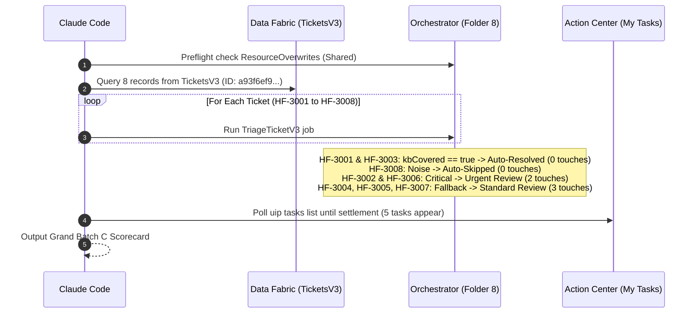
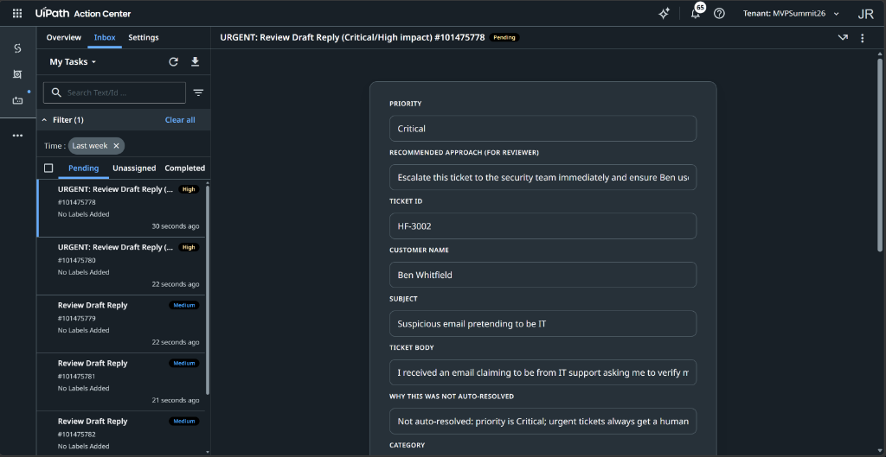
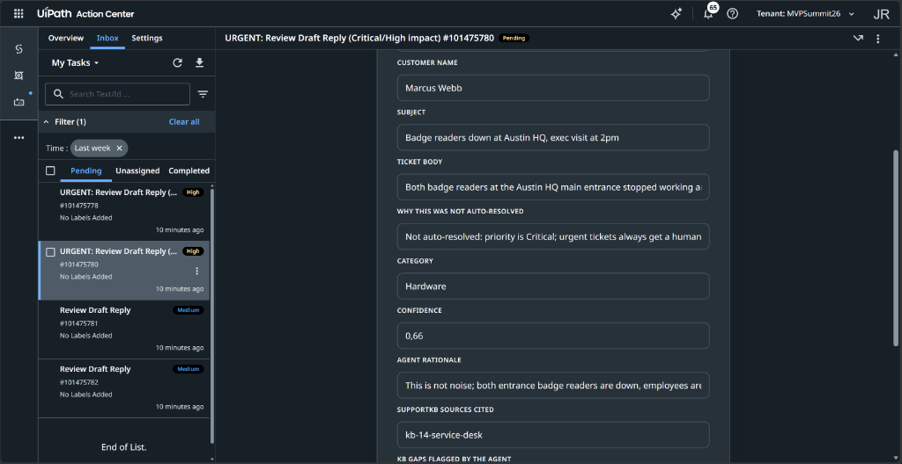
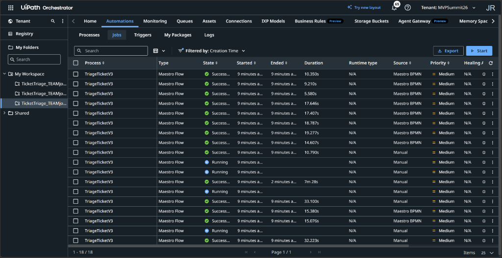

# Chapter 11: Run Batch C

> [!NOTE]
> **The Big Picture: Reaping the Rewards of Earned Autonomy with Batch C**  
> In Chapter 10, you deployed TriageTicketV3 with a dual-key safety gate combining model confidence with deterministic knowledge grounding. Now, in Chapter 11, you put earned autonomy to the ultimate test against Batch C (8 tickets from the shared TicketsV3 entity in Data Fabric). You observe your system achieve the milestone of enterprise agentic automation: 2 routine, knowledge-grounded tickets auto-resolve with zero human intervention; the automated maintenance notice is cleanly skipped; 2 critical operational emergencies fast-track to urgent human review; and 3 complex tickets (requiring staff action, missing policy, or with low confidence) fail safe to standard review. Human touches drop from 8 (in Batch A) and 7 (in Batch B) down to 5, eliminating 37.5% of manual ticket handling while maintaining 100% safety against unauthorized or hallucinated auto-replies.

In this chapter, you instruct your AI coding agent (**Claude Code**) to verify the newly deployed `TriageTicketV3` release, confirm its index grounding, and dispatch the final batch of support tickets (**Batch C**) through the autonomous flow.

| Step | Action | Description / Deliverable |
| :--- | :--- | :--- |
| **1. Grounding Preflight** | Inspect Release Overwrites | Verify `ResourceOverwrites` points `SupportKB` to `Shared` in Folder 8 |
| **2. Query Batch C** | Fetch `TicketsV3` Data | Query all 8 support tickets from Data Fabric entity `TicketsV3` |
| **3. Dispatch Batch** | Trigger `TriageTicketV3` | Launch 8 individual process runs in folder `TicketTriage_TEAM<user> 8` |
| **4. Settle & Monitor** | Track Execution | Poll until all instances reach `Completed` or open a task in Action Center |
| **5. Grand Scorecard** | Benchmark Touches | Verify scorecard: 2 auto-resolved, 1 auto-skipped, 2 urgent, 3 standard (5 touches) |

---

## 1. The Context Grounding Preflight in Folder 8

Before executing Batch C, we verify that the active release of `TriageTicketV3` in folder **`TicketTriage_TEAMjohannes-reitermayer 8`** (`f19c7f55-614a-4d7e-9d9e-b1461b8f4e11`) has its `ResourceOverwrites` correctly bound to the `Shared` folder.

### Grounding Verification via CLI

Run the following command to inspect the active `TriageTicketV3` process release:

```powershell
uip or processes get 0064213f-3561-4017-8bbb-72ce78422088 --all-fields
```

Verify that the `ResourceOverwrites` block points `SupportKB` to `Shared`:

```json
"ResourceOverwrites": [
  {
    "ResourceType": "Index",
    "ResourceKey": "SupportKB",
    "Properties2": [
      { "Name": "name", "Value": "SupportKB" },
      { "Name": "folderPath", "Value": "Shared" }
    ]
  }
]
```

> [!TIP]
> **Preflight Passed:**  
> During our Chapter 10 deployment verification, we confirmed that `SupportKB` in Folder 8 is already grounded in `Shared` (`folderPath: "Shared"`). When Claude Code runs the preflight check, it detects that the binding is already correct and proceeds straight to dispatching jobs.

---

## 2. Batch C Data Analysis & Live Autonomy Routing

Batch C contains 8 support tickets stored in Data Fabric entity **`TicketsV3`** (`Id: a93f6ef9-37a4-f111-9b32-000d3a69a13b`). You can query the records dynamically by name using:

```bash
! uip df records list $(uip df entities list --include-folders --output-filter "[?Name=='TicketsV3'].Id | [0]" --output plain)
```

Here is the empirical routing breakdown from our live run:

| Ticket ID | Customer Name | Subject | Grounding Source | Live V3 Routing | Action Center Task & Gate Reason |
| :--- | :--- | :--- | :--- | :--- | :--- |
| **HF-3001** | Nadia Osei | *Wifi code for visiting contractor* | `kb-08-guest-wifi` | **Safe Auto-Resolve** | **0 touches** (Grounded & independently verified against SupportKB) |
| **HF-3002** | Ben Whitfield | *Suspicious email pretending to be IT* | `kb-10-phishing` | **Urgent Review** | **Task #101475778 (High)** - Priority is Critical; urgent security tickets always get human review |
| **HF-3003** | Laura Jimenez | *Former employee needs last two payslips* | `kb-13-hr-portal-access` | **Safe Auto-Resolve** | **0 touches** (Grounded & independently verified against SupportKB) |
| **HF-3004** | Sam Torres | *Day 4 and still missing ERP access + design software* | `kb-11-onboarding` | **Standard Review** | **Task #101475781 (Medium)** - Resolution needs staff action (`needsStaffAction=true`) |
| **HF-3005** | Ingrid Vollan | *Home internet reimbursement for remote staff* | **No Runbook** | **Standard Review** | **Task #101475779 (Medium)** - Failed safe; confidence 0.58 < 0.85 and no KB runbook exists |
| **HF-3006** | Marcus Webb | *Badge readers down at Austin HQ, exec visit at 2pm* | Facility outage | **Urgent Review** | **Task #101475780 (High)** - Priority is Critical; urgent outage tickets always get human review |
| **HF-3007** | Denise Cole | *Cedar room AV failed during customer demo again* | `kb-12-meeting-rooms` | **Standard Review** | **Task #101475782 (Medium)** - Low confidence (0.72 < 0.85); customer demo escalation |
| **HF-3008** | noreply@homefixsupply.example | *Scheduled maintenance notification - HR portal* | Automated blast | **Noise Auto-Skip** | **0 touches** (Automated noise filtered at switch, confidence 0.99) |

---

## 3. The Chapter 11 Prompts

Ensure your terminal is inside your interactive **Claude Code** session in your project workspace directory.

### Option 1: Baseline Prompt
```text
Before running anything, check the V3 release's index ResourceOverwrites and patch folderPath to "Shared" if it points at my team folder. Then run every ticket in the shared TicketsV3 entity through V3, one job each, and report when every instance is Completed or has an open task.
```

---

### Option 2: Optimized Context-Rich Prompt (Recommended)
```text
Before running anything, inspect the TriageTicketV3 process release in my workspace folder:
1. Verify the release's ResourceOverwrites for index 'SupportKB'. If folderPath points to my personal folder, patch it to 'Shared' via Orchestrator API so context grounding succeeds.
2. Query all 8 records from the shared TicketsV3 entity in Data Fabric (entity ID a93f6ef9-37a4-f111-9b32-000d3a69a13b).
3. Run each ticket through TriageTicketV3 using uip maestro flow process run with inputs: ticketId, subject, body, customerName.
4. Poll the jobs and Action Center tasks until all 8 runs settle (either Completed or in a Pending task).
5. Output the Grand Batch C Scorecard:
   - Verify how many tickets safely auto-resolved (HF-3001, HF-3003).
   - Verify how many noise tickets auto-skipped (HF-3008).
   - Verify how many urgent tickets created high-priority tasks (HF-3002, HF-3006).
   - Verify how many tickets failed safe to standard review (HF-3004, HF-3005, HF-3007).
   - Report the final count of Action Center tasks.
```

---

## 4. Execution & Settlement Architecture

When Claude Code executes Batch C, the workflow coordinates four operational paths concurrently:



---

## 5. The Evolution Scorecard: Batch A vs. Batch B vs. Batch C

By running Batch C through `TriageTicketV3`, you witness the complete progression of Agentic Automation:

| Dimension | Batch A (Chapter 5) | Batch B (Chapter 8) | Batch C (Chapter 11) | Net Workshop Impact |
| :--- | :--- | :--- | :--- | :--- |
| **Solution Version** | `1.0.1` (`TriageTicketV1`) | `1.0.2` (`TriageTicketV2`) | `1.0.3` (`TriageTicketV3`) | 3 evolutionary iterations |
| **Flow Architecture** | 1 Linear Review Path | 3 Routing Branches | 4 Paths + Dual Verification | Full autonomy framework |
| **Knowledge Grounding** | Draft reply generation | Draft reply generation | Dual-Key Safety Gate | Safe autonomous sending |
| **Noise Handling** | Reviewed by hand | **Auto-Skipped** | **Auto-Skipped** | 100% spam eliminated |
| **Urgent Incidents** | Buried in inbox | **Fast-Tracked (High)** | **Fast-Tracked (High)** | Zero SLA breaches |
| **Routine Tickets** | Reviewed by hand | Reviewed by hand | **Safe Auto-Resolved** | 2 tickets hands-free |
| **Uncovered / Policy Tickets** | Reviewed by hand | Reviewed by hand | **Fail-Safe Review** | Zero hallucinations |
| **Total Human Touches** | **8 touches (100%)** | **7 touches (87.5%)** | **5 touches (62.5%)** | **37.5% Effort Reduction** |

---

## 6. Checkpoint & Verification

### 6.1 Visual Inspection from Action Center & Orchestrator

#### Action Center: Initial Pending Inbox (5 Tasks Created)


#### Action Center: Urgent Outage Task Detail (HF-3006)


#### Orchestrator: Batch C Jobs in Folder 8


### 6.2 Checkpoint Findings:
1. **Zero Spam in Action Center:** `HF-3008` was skipped to End with 0 human touches.
2. **Zero Overhead on Routine Inquiries:** `HF-3001` (contractor Wi-Fi) and `HF-3003` (payslips) were independently verified against `SupportKB` and auto-resolved.
3. **Security Protection:** `HF-3002` (phishing email) was classified as Critical and routed to human review, preventing automated replies to security incidents.
4. **Safety Against Missing Runbooks:** `HF-3005` (home internet reimbursement) failed safe with `confidence: 0.58` because `SupportKB` contains no reimbursement runbook.
5. **Staff Action Guard:** `HF-3004` (ERP access) was held for review because provisioning requires manager and IT administrator action.

---

## 7. Troubleshooting Guide

| Symptom / Error | Root Cause | Exact Fix |
| :--- | :--- | :--- |
| **`Context grounding index not found`** | `ResourceOverwrites` in Folder 8 reset to local folder. | Patch `folderPath` to `"Shared"` on the `TriageTicketV3` release using Orchestrator CLI. |
| **`HF-3005` was auto-resolved without approval** | The safety gate checked only `confidence` without verifying `kbCovered`. | Ensure `TriageTicketV3` validates `kbCovered == true` before taking the auto-resolve branch. |
| **Urgent outage tickets (`HF-3006`) auto-resolved** | The auto-resolve switch branch lacked the priority condition check. | Confirm the auto-resolve condition includes `priority != 'Critical' && priority != 'High'`. |
| **More than 5 tasks appear in Action Center** | Auto-resolved tickets created extraneous task cards. | Verify that the `Auto-Resolved` branch connects directly to an End node without passing through a Quick Form. |

---

## 8. Summary: The Complete Agentic Lifecycle

Congratulations! You have completed the full evolution of enterprise Agentic Automation:
1. **V1 (Supervised Baseline):** 100% human oversight across all tickets.
2. **V2 (Multi-Path Triage):** Noise auto-skipping and critical incident fast-tracking.
3. **V3 (Earned Autonomy):** Rigorous dual-key knowledge grounding allowing routine tickets to auto-resolve safely while failing safe on complex inquiries.
