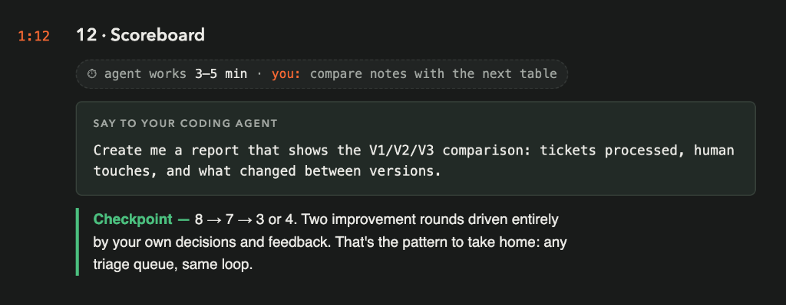
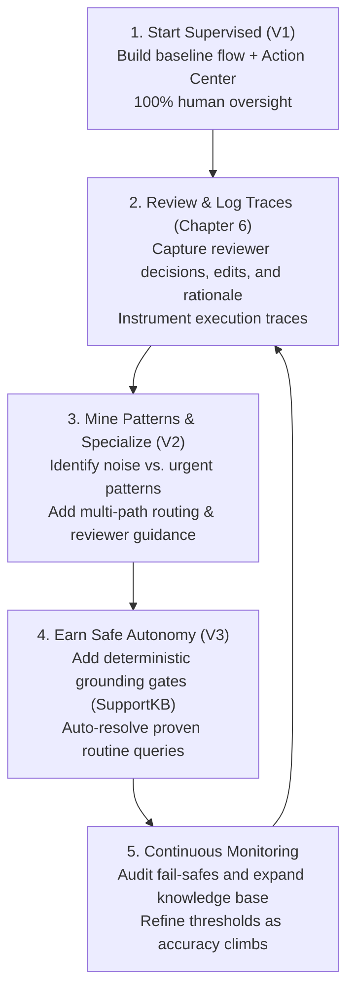

# Chapter 12: Scoreboard & The Continuous Improvement Loop

> [!NOTE]
> **The Big Picture: Two Rounds of Evolution Driven by Your Decisions**  
> You started in Chapter 3 with a simple supervised baseline (V1) that required human review for every single ticket (8 touches). By reviewing tickets by hand in Chapter 6 and mining your own review feedback in Chapter 7, you evolved the architecture to V2, eliminating noise and fast-tracking emergencies (7 touches). In Chapter 10, you introduced a dual-key knowledge grounding safety gate, earning safe autonomy in V3 and driving human touches down to 5 (a 37.5% reduction). Two full evolutionary cycles, driven entirely by human-in-the-loop decisions and trace feedback. That is the universal pattern to take home: for any enterprise queue, apply the same loop to move safely from supervised assistance to earned autonomy.

In this capstone chapter, you instruct your AI coding agent (**Claude Code**) to synthesize the complete end-to-end journey into an executive comparison report across all three generations of the triage system.



| Step | Action | Description / Deliverable |
| :--- | :--- | :--- |
| **1. Request Scoreboard** | Prompt Claude Code | Request comparative telemetry report across V1, V2, and V3 |
| **2. Review Embedded Report** | Inspect In-Chapter Report | Examine the live generated `scoreboard-report.md` included below |
| **3. Analyze Telemetry** | Understand 8 -> 7 -> 5 | Trace why the safety gate held back 2 tickets to protect safety |
| **4. Codify the Loop** | Extract Production Flywheel | Formalize the 4-step evolutionary loop for enterprise deployment |
| **5. Final Sign-Off** | Workshop Completion | Celebrate the transition from 100% human review to earned autonomy |

---

## 1. The Three Generations Compared (V1 vs. V2 vs. V3)

Across the workshop, you deployed three successive iterations of the triage solution, testing each against a fresh batch of 8 support tickets from Data Fabric:

| Dimension | Generation 1 (V1 Baseline) | Generation 2 (V2 Multi-Path) | Generation 3 (V3 Earned Autonomy) |
| :--- | :--- | :--- | :--- |
| **Chapter / Slide** | Chapter 3-5 (Slide 3-5) | Chapter 7-8 (Slide 7-8) | Chapter 10-11 (Slide 10-11) |
| **Solution Version** | `1.0.1` | `1.0.2` | `1.0.3` |
| **Flow Name** | `TriageTicketV1` | `TriageTicketV2` | `TriageTicketV3` |
| **Test Dataset** | Batch A (`TicketsV1`, 8 tickets) | Batch B (`TicketsV2`, 8 tickets) | Batch C (`TicketsV3`, 8 tickets) |
| **Flow Architecture** | Single linear review path | 3-way routing switch | 4-way routing switch + dual agent verifier |
| **Agent Reasoning** | Classification & draft reply | + `recommendedApproach` field | + `kbCovered` flag, `kbSources`, `autonomyGate` |
| **Grounding Mechanism** | Passive context retrieval | Passive context retrieval | Active dual verification gate |
| **Noise / Spam** | Reviewed by human (1 touch) | **Auto-Skipped (0 touches)** | **Auto-Skipped (0 touches)** |
| **Critical Incidents** | Buried in standard queue | **High-Priority Escalation** | **High-Priority Escalation** |
| **Routine KB Inquiries** | Reviewed by human | Reviewed by human | **Safe Auto-Resolved (0 touches)** |
| **Missing KB Runbooks** | Reviewed by human | Reviewed by human | **Fail-Safe Fallback (1 touch)** |
| **Total Human Touches** | **8 touches (100%)** | **7 touches (87.5%)** | **5 touches (62.5%)** |
| **Effort Reduction** | Baseline (0%) | 12.5% reduction | **37.5% effort reduction** |

---

## 2. What Changed Between Generations

### Generation 1: The Supervised Baseline (`TriageTicketV1`)
- **What it did:** Every incoming ticket was classified by an AI agent, grounded in `SupportKB`, and forwarded to an Action Center Quick Form task assigned to the attendee.
- **Why it was weak:** 
  - Zero urgency awareness: Critical outages sat in the same queue as routine questions.
  - Zero spam filtering: Automated notifications and newsletters required manual opening and clicking.
  - No reviewer guidance: Reviewers had to evaluate raw drafts without suggested next steps.
- **Human Touchpoints:** 8 out of 8 tickets (100% manual review).

### Generation 2: Mining Human Decisions (`TriageTicketV2`)
- **What changed:** By inspecting your Chapter 6 review decisions and trace feedback, Claude Code evolved the architecture:
  - Added a **Decision Switch** with 3 distinct operational paths.
  - Introduced the **Noise Branch** (`category == 'Noise' && confidence >= 0.8`), dropping newsletters directly to End with 0 touches.
  - Introduced the **Urgent Escalation Branch** (`priority == 'Critical' || priority == 'High'`), routing emergencies to dedicated High-priority tasks.
  - Added the **`recommendedApproach`** output to guide human reviewers.
- **Human Touchpoints:** Dropped from 8 to 7 touches (12.5% savings).

### Generation 3: Earned Autonomy (`TriageTicketV3`)
- **What changed:** In Chapter 9, you observed that routine tickets with clear runbooks were consistently approved as-is. V3 took the leap into autonomous resolution:
  - Added a **Dual-Key Safety Gate**: Required both statistical confidence (`confidence >= 0.85`) AND deterministic knowledge grounding (`kbCovered == true` + valid `kbSources`).
  - Added an independent **Verifier Agent** that audits drafts against `SupportKB` runbooks before granting autonomy.
  - Safe routine inquiries (`HF-3001` guest Wi-Fi, `HF-3003` former employee payslips) auto-resolved with zero human intervention.
  - Uncovered inquiries (`HF-3005` home internet reimbursement) or tickets requiring human staff action (`HF-3004` ERP access) safely failed safe to human review.
- **Human Touchpoints:** Dropped from 7 to 5 touches (37.5% savings with 100% enterprise safety).

---

## 3. The Chapter 12 Prompts

Ensure your terminal is inside your interactive **Claude Code** session in your team workspace directory.

### Option 1: Baseline Prompt (From Tuan's Slide)
This is the concise prompt from Product Manager Tuan's slide:

```text
Create me a report that shows the V1/V2/V3 comparison: tickets processed, human touches, and what changed between versions.
```

---

### Option 2: Context-Rich Optimized Prompt (Recommended)
This version instructs Claude Code to inspect the historical logs across all three batches, pull exact job and task counts, and format a comprehensive markdown report artifact:

```text
Create an executive scoreboard report comparing V1, V2, and V3 triage workflows across our solution:
1. Query the live telemetry and execution records across all three batches:
   - Batch A (Folder 7, TriageTicketV1, 8 tickets)
   - Batch B (Folder 6, TriageTicketV2, 8 tickets)
   - Batch C (Folder 8, TriageTicketV3, 8 tickets)
2. Compare key metrics:
   - Total tickets processed per generation.
   - Human touchpoints required (8 -> 7 -> 5).
   - Architectural evolution (single path -> 3-way switch -> 4-way switch with dual verification).
   - Safety gates and grounding mechanisms introduced.
3. Save the report to 'scoreboard-report.md' and summarize the primary takeaways in the terminal.
```

---

## 4. The Official Scoreboard Report (`scoreboard-report.md`)

> [!NOTE]
> **Official Workshop Report Deliverable**  
> Below is the complete, unabridged content of [**`scoreboard-report.md`**](file:///c:/Users/jre/triage-lab-TEAMjohannes-reitermayer/scoreboard-report.md), generated by your AI coding agent from live Orchestrator and Action Center telemetry across all three batches (Folders 7, 6, and 8). This constitutes the formal final report required by Chapter 12.

### Ticket Triage Scoreboard: V1 vs V2 vs V3

**Solution:** `TicketTriage_TEAMjohannes-reitermayer` (tenant `MVPSummit26`, org `uipathlabsworkshop`)
**Data as of:** 2026-09-13 14:28 UTC, pulled live with `uip tasks list`, `uip tasks data get` and `uip or jobs get` for every job in all three batches. Collector script and raw output: `scratch/ch12/collect.py`, `scratch/ch12/live.json`.

---

### 4.1. Headline

| Metric | V1 (Batch A) | V2 (Batch B) | V3 (Batch C) |
| :--- | :---: | :---: | :---: |
| Flow / release | `TriageTicketV1` | `TriageTicketV2` (1.0.2) | `TriageTicketV3` (1.0.3) |
| Tickets processed | **8** | **8** | **8** |
| Jobs faulted | 0 | 0 | 0 |
| **Human touches (Action Center tasks)** | **8 (100%)** | **7 (87.5%)** | **5 (62.5%)** |
| Zero-touch tickets | 0 | 1 | **3** |
| of which auto-skipped noise | 0 | 1 | 1 |
| of which auto-resolved (reply sent, no human) | 0 | 0 | **2** |
| Urgent tasks (High priority) | 0 | 1 | 2 |
| Standard tasks (Medium priority) | 8 | 6 | 3 |
| Reduction in touches vs V1 | baseline | -12.5% | **-37.5%** |
| Time to close a zero-touch ticket | n/a | 10 s | 11 to 33 s |
| Time to close a reviewed ticket | 53 to 57 min | 41 to 42 min | 7.5 min (1 closed so far) |

**Measured progression: 8 -> 7 -> 5 human touches.**

> [!IMPORTANT]
> Chapter 12 says V3 should reach **3 or 4** touches. This run got **5**. Nothing broke. The deterministic safety gate refused autonomy for HF-3004 (the ticket needs staff action) and HF-3007 (confidence 0.72, KB gaps), and both went to a human as designed. Chapter 11's own scorecard also shows 5. See section 5 for why the gate held those tickets back.

---

### 4.2. Per-ticket routing

#### 4.2.1 Batch A: V1 (every ticket goes to one review queue)

| Ticket | Subject | Agent category / priority / confidence | Route | Reviewer outcome |
| :--- | :--- | :--- | :--- | :--- |
| HF-1001 | Locked out of my account | Access / High / 0.96 | Review (Medium) | Approve |
| HF-1002 | VPN stuck on Connecting from hotel | Network / Medium / 0.93 | Review (Medium) | Approve |
| HF-1003 | Duplicate charge showing in Concur | Billing / Low / 0.96 | Review (Medium) | Approve |
| HF-1004 | Two questions: monitor entitlement and guest wifi | Other / Low / 0.92 | Review (Medium) | Approve |
| HF-1005 | Connect NetSuite to HomeFix inventory API | Software / Low / 0.73 | Review (Medium) | Approve |
| HF-1006 | URGENT: Rotterdam DC scanning system down, trucks waiting | Network / **Critical** / 0.72 | Review (**Medium**) | Modify & Send |
| HF-1007 | Third delay on my laptop replacement - escalating | Hardware / Medium / 0.86 | Review (Medium) | Modify & Send |
| HF-1008 | Out of Office Re: Your order confirmation | Other / Low / 0.87 | Review (Medium) | Reject |

Outcomes: 5 Approve, 2 Modify & Send, 1 Reject. All 8 reviewed by hand (Chapter 6).

#### 4.2.2 Batch B: V2 (noise skip, urgent queue, standard queue)

| Ticket | Subject | Agent category / priority / confidence | Route | Reviewer outcome |
| :--- | :--- | :--- | :--- | :--- |
| HF-2001 | Password expires while I'm on leave | Access / Low / 0.88 | Standard | Approve |
| HF-2002 | HomeFix-Print queue disappeared | Software / Medium / 0.93 | Standard | Approve |
| HF-2003 | Old expense report rejected - over 90 days | Billing / Low / 0.86 | Standard | Approve |
| HF-2004 | New phone MFA + shared mailbox for team | Access / Low / 0.95 | Standard | Approve |
| HF-2005 | Dual-boot Linux on company laptop for data science | Software / Low / 0.76 | Standard | Modify & Send |
| HF-2006 | Concur down for all of finance, month-end close TODAY | Software / Critical / 0.82 | **Urgent (High)** | Modify & Send |
| HF-2007 | Software request stuck three weeks - unacceptable | Software / Low / 0.84 | Standard | Modify & Send |
| HF-2008 | SupplyTech Weekly: 10 warehouse trends for 2027 | Noise | **Auto-skipped** | none (0 touches) |

Outcomes: 4 Approve, 3 Modify & Send, 0 Reject. Claude Code completed the 7 reviews through `uip tasks complete` (Chapter 9). They still count as touches because each task needed a decision.

#### 4.2.3 Batch C: V3 (safety gate, independent verifier, auto-resolve)

| Ticket | Subject | Agent category / priority / confidence | Route | Gate reason (from the task / job output) | Status |
| :--- | :--- | :--- | :--- | :--- | :--- |
| HF-3001 | Wifi code for visiting contractor | Network / Low | **Auto-resolved** | Gate passed, verifier confirmed every claim against `kb-08-guest-wifi` | Closed, 0 touches |
| HF-3002 | Suspicious email pretending to be IT | Other / Critical / 0.91 | **Urgent (High)** | Priority Critical: urgent tickets always get a human | Task 101475778 pending |
| HF-3003 | Former employee needs last two payslips | Access / Low | **Auto-resolved** | Gate passed, verifier confirmed every claim against `kb-13-hr-portal-access` | Closed, 0 touches |
| HF-3004 | Day 4 and still missing ERP access + design software | Access / Medium / 0.90 | Standard | `needsStaffAction=true` (ERP access needs a role-template change) | Task 101475781 pending |
| HF-3005 | Home internet reimbursement for remote staff | Billing / Low / 0.58 | Standard | Confidence 0.58 < 0.85, `kbCovered=false`, KB gaps flagged | Task 101475779 **Approved** |
| HF-3006 | Badge readers down at Austin HQ, exec visit at 2pm | Hardware / Critical / 0.66 | **Urgent (High)** | Priority Critical: urgent tickets always get a human | Task 101475780 pending |
| HF-3007 | Cedar room AV failed during customer demo again | Hardware / Medium / 0.72 | Standard | Confidence 0.72 < 0.85, `kbCovered=false`, KB gaps flagged | Task 101475782 pending |
| HF-3008 | Scheduled maintenance notification - HR portal | Noise / Low / 0.99 | **Auto-skipped** | Automated noise | Closed, 0 touches |

The verifier agent ran on 2 tickets and confirmed both. No ticket reached the `groundingReview` path: the 3 standard tickets were stopped by the deterministic gate before the verifier ran.

---

### 4.3. What changed between versions

#### 4.3.1 V1: Supervised Baseline

`Trigger -> Classify & Draft agent (SupportKB) -> Review Draft Reply (Quick Form, Medium) -> End`

- One agent returns category, priority, confidence, rationale and a draft reply, grounded in SupportKB.
- Every ticket goes to one Action Center form with Approve, Modify & Send and Reject outcomes.
- End outputs: `decision`, `finalReply`, `category`, `priority`.

**Problems found in the Batch A review (Chapters 6 and 7):**

1. **Urgency was ignored.** The agent tagged HF-1006 (Rotterdam DC down, trucks waiting) as **Critical**, but the flow made it a Medium task, the same as a duplicate-charge question. HF-1001 was tagged High and got the same treatment.
2. **Noise took a human's time.** HF-1008 was an Out-of-Office auto-reply, and a person had to open it and click Reject.
3. **Reviewers got no guidance.** The form showed the draft but not what to do beyond sending it. In the modified drafts the line breaks were lost, and reviewers typed internal notes ("soften the tone!") into the customer reply because the form had no other place for them.

#### 4.3.2 V1 -> V2: Routing From Mined Decisions

`Trigger -> Classify, Draft & Recommend agent -> Route switch -> { Noise: End | Critical/High: Urgent Review (High) | default: Standard Review (Medium) } -> End`

| Change | Fixes |
| :--- | :--- |
| New **`routeTicket` switch** with 3 paths | The single queue |
| **Noise path**: `category == Noise AND confidence >= 0.8` goes straight to End | HF-1008-style auto-replies (Batch B: HF-2008 skipped in 10 s) |
| **Urgent path**: priority `critical`/`high`/`urgent` becomes a **High**-priority task titled "URGENT: Review Draft Reply" | Urgent tickets sitting in the normal queue (Batch B: HF-2006 fast-tracked) |
| The rule includes **Critical**, not just "Urgent or High" | V1 already said Critical for HF-1006, so a narrower rule would have missed it |
| New agent output **`recommendedApproach`**: next action, operational step, what to check | No guidance for reviewers |
| New form field **`reviewernote`**, returned as an End output | Internal notes typed into customer drafts |

**Result:** 8 -> 7 touches. The only saving came from the noise skip. The urgent path makes the queue better ordered but does not remove any touches.

#### 4.3.3 V2 -> V3: Autonomy Only Where It Can Be Checked

`Trigger -> Classify, Draft & Assess KB Coverage agent -> Safety Gate (script) -> Route switch -> { Noise: End | Urgent: Urgent Review | Candidate: Verifier agent -> Grounding Check (script) -> { Verified: Auto-Resolved End | else: Grounding Review } | default: Standard Review }` with 5 separate End nodes

**What the Batch B reviews showed (Chapter 9):** HF-2001 to HF-2004 were approved as-is. Each was a self-service answer fully covered by a SupportKB article. The 3 rewrites were tickets where the KB had no answer: HF-2005 said "we have no helpdesk article", and HF-2006 and HF-2007 needed escalation or someone to chase a request. So the difference between "safe to send" and "needs a human" was whether the KB covers the answer and no staff action is needed. The confidence score alone did not separate them.

| Change | Why |
| :--- | :--- |
| Agent outputs **`kbCovered`**, **`kbSources[]`**, **`kbGaps[]`**, **`needsStaffAction`** | The agent must say what it grounded the draft on and what is missing |
| **Deterministic safety gate** (`checkSafetyGate` script). Auto-resolve requires all of: priority Low/Medium, confidence >= 0.85, `kbCovered === true`, empty `kbGaps`, `needsStaffAction === false`, and every citation in the 14 known KB articles. The draft must also avoid blocked phrases (`escalat`, `on-call`, `knowledge base`, `[`, `placeholder`, ...) | The agent's own flags are treated as claims to check. If anything is missing or unexpected, the ticket goes to review |
| **Independent verifier agent** (`verifyGrounding`) with its own SupportKB context. It splits the draft into claims and checks each one | A second agent has to confirm the draft before it is sent |
| **Deterministic grounding check** (`checkVerification`) and an **`autoResolveDecision`** switch | Only an explicit `verified === true` leads to auto-resolve. Anything else goes to Grounding Review |
| New End output **`autonomyGate`**, plus a form field showing it | Every ticket records why it was or was not auto-resolved |
| `finalReply` is empty after Reject (V2 kept the rejected draft) | A rejected draft can't be mistaken for the sent reply |

**Result:** 7 -> 5 touches. 2 tickets were resolved with no human and 1 was skipped as noise. The gate blocked every ticket with a KB gap or a needed staff action.

---

### 4.4. Side-by-side capabilities

| Capability | V1 | V2 | V3 |
| :--- | :---: | :---: | :---: |
| Classify + draft grounded in SupportKB | yes | yes | yes |
| Noise auto-skip | no | yes | yes |
| Urgent High-priority queue | no | yes | yes |
| `recommendedApproach` for reviewers | no | yes | yes |
| Separate reviewer note field | no | yes | yes |
| KB coverage flags (`kbCovered`, `kbSources`, `kbGaps`, `needsStaffAction`) | no | no | yes |
| Deterministic safety gate | no | no | yes |
| Independent verifier agent | no | no | yes |
| Auto-resolve with no human | no | no | yes |
| Audit reason per ticket (`autonomyGate`) | no | no | yes |
| Flow nodes (excluding KB context) | 4 | 6 | 15 |
| Review queues | 1 | 2 | 3 |
| End states | 1 | 1 | 5 |

---

### 4.5. Why V3 got 5 touches instead of 3 or 4

| Ticket | Could it have been zero-touch? | Why not |
| :--- | :--- | :--- |
| HF-3002, HF-3006 | No, by design | Critical tickets always go to a human |
| HF-3005 | No | SupportKB has no home-internet reimbursement policy. The gate caught it and the reviewer approved the fallback reply with a note to expand the KB |
| HF-3004 | Only if `needsStaffAction` were dropped from the gate | The KB does cover the steps (`kb-11-onboarding`, `kb-05-software-requests`), but getting ERP access means someone has to file an access request. Sending the reply without anyone following up would leave the new hire stuck |
| HF-3007 | Only if the KB named an AV escalation owner | The KB has no owner for repeat room-AV failures and no dispatch process, so confidence was 0.72 and the agent flagged gaps |

Getting to 3 or 4 touches would mean weakening a safety rule (HF-3004) or adding knowledge (HF-3007). **Adding knowledge is the right lever.** The flagged gaps below are a ready backlog for SupportKB:

- Home internet reimbursement for remote staff: eligibility, how to claim, Concur category (HF-3005)
- Who owns AV escalation for repeat meeting-room failures, and the dispatch process (HF-3007)
- Facilities or building-access escalation path and badge-reader outage workaround (HF-3006; urgent, so it still needs a human, but the draft would be better)

When an article is added, also add its id to `KB_DOCS` in `gate_check_safety.js`. Until then, the gate blocks auto-resolve for any ticket that cites the new article.

---

### 4.6. Caveats

1. **Each version ran a different batch of 8 tickets**, each built to exercise that version's paths. Touch counts show how the design progressed, not a controlled A/B test on the same tickets. The V3 gate unit tests (`scratch/build/v3/test_gates.mjs`) use the real Batch B agent outputs and expect HF-2001, HF-2002 and HF-2004 to auto-resolve. That is a prediction; V3 has not been run on Batch B.
2. **Batch C is not fully settled.** 4 of 5 review tasks (HF-3002, HF-3004, HF-3006, HF-3007) are still pending, so their jobs show `Running`. Touch counts won't change, but reviewer outcomes for those tickets aren't known yet.
3. **Who reviewed differs by batch.** Batch A was reviewed by hand. Batch B was reviewed by Claude Code (Chapter 9). Batch C so far has one completed review (HF-3005). Rates such as Modify & Send (2/8 vs 3/7) mix reviewer behaviour with model behaviour.
4. **HF-2007's rewritten reply was lost.** The task completed with Modify & Send, but the job output has `finalReply = null` because the completion payload used PascalCase keys (`Draftreply`) instead of the form's lowercase field ids. The rewritten text exists only in the Action Center task data. The ticket still counts as a touch.
5. **Review times are not comparable.** They include time waiting in the queue (tasks reviewed in a batch), not just time spent reviewing.

---

### 4.7. Takeaways

1. **8 -> 7 -> 5.** Two design rounds cut human touches by 37.5% with no faulted jobs and nothing auto-sent that the verifier had not confirmed.
2. **V2 mostly organised the work.** It removed one touch (noise), but its main effect was ordering: Critical tickets now reach a High-priority queue instead of sitting at Medium.
3. **V3 is where touches went down.** Autonomy depends on three things, not on confidence alone: a deterministic gate, an independent verifier, and a clear rule that tickets needing staff action go to a person.
4. **Auto-resolve rules came from reviewer decisions, not guesses.** V2's routing rules came from Batch A decisions, including the Critical ticket V1 left at Medium. V3's rules came from which Batch B tickets were approved as-is.
5. **The next step is adding knowledge, not lowering thresholds.** Each `kbGaps` entry names a missing article. Fill those gaps, update `KB_DOCS`, and run another batch.

---

## 5. The Take-Home Pattern: The Agentic Automation Flywheel

The greatest value of this workshop is not just the three flows you built, but the **repeatable operational methodology** you practiced. 

Whenever you automate an enterprise triage or decision queue in production, follow this 4-step flywheel:



### The Four Golden Rules of Agentic Triage:
1. **Never Start with Full Autonomy:** Always launch in supervised mode (V1). Let real human reviewers establish the baseline truth.
2. **Mine Real Decisions, Don't Guess Rules:** Analyze actual approval and rejection logs (Chapter 7) to identify what can be safely separated (noise, critical, routine).
3. **Dual-Key Safety Over Raw Confidence:** Never auto-send based on model confidence alone. Require verified knowledge base grounding (`kbCovered` + `kbSources`).
4. **Design Fail-Safe by Default:** When an agent is unsure, when KB runbooks are missing, or when an inquiry requires human staff action, the system must seamlessly fall back to human review without failing.

---

## 6. Checkpoint & Verification

### 6.1 Checkpoint Criteria
Verify that your report meets all official workshop criteria:
- **Progression Verified:** Demonstrates the clear drop in human touches: **`8 -> 7 -> 5`** (with explanation of why the safety gate held `HF-3004` and `HF-3007`).
- **Two Improvement Rounds:** Explains how human review decisions in Chapter 6 directly informed V2, and how Action Center patterns in Chapter 9 directly informed V3.
- **Root Architecture Documented:** Explains what changed between versions (linear review -> multi-path routing -> earned autonomy with dual-key grounding).
- **Universal Pattern Articulated:** Summarizes the repeatable loop applicable to any enterprise triage queue.

---

## 7. Workshop Retrospective & Summary

Over the course of 12 chapters, you have built, deployed, tested, and refined an enterprise-grade agentic solution using:
- **UiPath CLI (`uip`)**: Managing auth, solutions, folders, processes, jobs, Data Fabric, and tasks entirely from the command line.
- **Claude Code**: Acting as an autonomous pair programmer and autonomous task reviewer.
- **UiPath Maestro Flow**: Designing complex multi-path workflows with conditional routing and human-in-the-loop checkpoints.
- **UiPath Context Grounding**: Connecting AI reasoning directly to enterprise documentation in `SupportKB`.
- **UiPath Action Center**: Providing governance, auditability, and seamless human-agent collaboration.

You have proven that with the right architecture and safety gates, enterprise automation can earn autonomy safely, reducing manual toil while maintaining complete human control over critical decisions.
