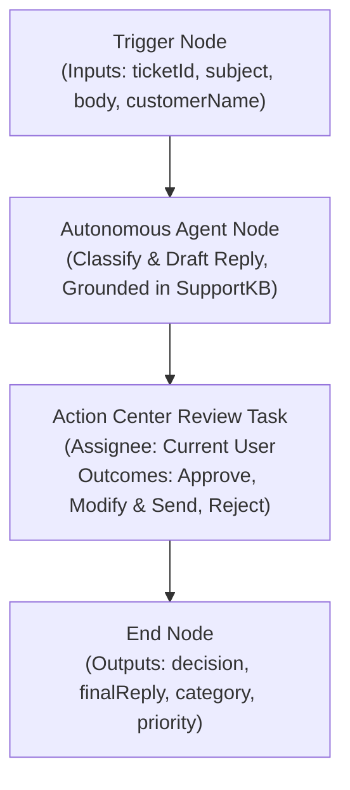
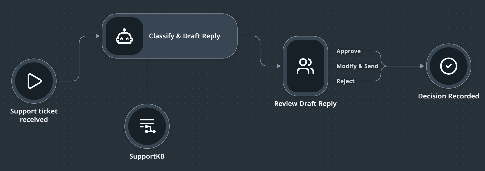

# Chapter 3: Build V1

> [!NOTE]
> **The Big Picture: The First Autonomous Build**  
> Instead of spending hours dragging nodes and configuring activities by hand, you give Claude Code a high-level intent prompt. In under 8 minutes, the agent scaffolds the solution, links the knowledge index, wires custom Action Center outcome buttons, and uploads a valid, deployable Maestro Flow to Studio Web.

In this chapter, you instruct your AI coding agent (**Claude Code**) to scaffold and build your first **UiPath Maestro Flow** automation solution: **`TicketTriage_TEAM<firstname>-<lastname>`**. 

The flow receives an incoming customer support ticket, invokes an autonomous agent grounded in your shared knowledge base (`SupportKB`) to classify the ticket and draft a reply, and creates an Action Center review task assigned to your user account with three custom review outcomes.

| Step | Action | Description / Deliverable |
| :--- | :--- | :--- |
| **1. Session Check** | Verify Workspace & Agent | Confirm Claude Code is active in your team directory |
| **2. Prompt Execution** | Discover Identity & Send Prompt | Run `! uip user` and send Build V1 prompt |
| **3. Parallel Reading** | Read Ahead for Step 5 | Review deployment preparation while the agent runs (4-6 min) |
| **4. Checkpoint** | Validate & Inspect | Verify designer URL, index link, assignee, and canvas nodes |

---

## 1. Overview & Architecture

### 1.1 Flow Architecture



### 1.2 Key Anchors and Parameters

| Parameter | Value / Requirement | Notes |
| :--- | :--- | :--- |
| **Solution Name** | `TicketTriage_TEAM<firstname>-<lastname>` | Scaffolds `.uipx` bundle in your team directory |
| **Flow Name** | `TriageTicketV1` | The root Maestro Flow project |
| **Flow Inputs** | `ticketId`, `subject`, `body`, `customerName` | String properties received on trigger |
| **Knowledge Base** | `SupportKB` in folder `Shared` | Context Grounding index verified in Chapter 2 |
| **Human Task Assignee** | `type: "user"` with your email | Dynamically queried via `uip or users current` |
| **Task Outcomes** | `Approve`, `Modify & Send`, `Reject` | Custom Action Center decision paths |
| **Lifecycle Target** | Upload to Studio Web | Uploaded for visual inspection; **not published** yet |

---

## 2. The Build Prompt

Ensure your terminal is inside your interactive **Claude Code** session from Chapter 2.

### 2.1 Discover Your User Identity: `uip user` vs. `uip or users current`

Before sending the build prompt, inspect how the UiPath CLI sees your identity across different platform layers directly from within Claude Code.

#### Command 1: Core CLI Identity (`uip user`)
Queries your active login token and Identity Server profile. It provides distinct **`FirstName`** and **`LastName`** fields:

```text
! uip user
```

*Expected output:*
```json
{
  "Result": "Success",
  "Code": "User",
  "Data": {
    "IdentityType": "User",
    "UserId": "d6aae5e3-3c55-4bfb-b5f8-6b17248bca11",
    "Name": "johannes.reitermayer@gmail.com",
    "Username": "johannes.reitermayer@gmail.com",
    "Email": "johannes.reitermayer@gmail.com",
    "FirstName": "Johannes",
    "LastName": "Reitermayer"
  }
}
```

#### Command 2: Orchestrator User Identity (`uip or users current`)
Queries the **Orchestrator** service on your tenant. It returns your user record and email within the Orchestrator directory:

```text
! uip or users current
```

*Expected output:*
```json
{
  "Result": "Success",
  "Code": "User",
  "Data": {
    "Key": "d6aae5e3-3c55-4bfb-b5f8-6b17248bca11",
    "UserName": "johannes.reitermayer@gmail.com",
    "FullName": "Johannes Reitermayer",
    "Email": "johannes.reitermayer@gmail.com",
    "Type": "DirectoryUser",
    "IsActive": true
  }
}
```

| Command | Scope | Key Returned Fields | Purpose in Workshop |
| :--- | :--- | :--- | :--- |
| **`uip user`** | Core CLI / Identity Server | `FirstName`, `LastName`, `Email` | Matches team workspace folder (`triage-lab-TEAM<firstname>-<lastname>`) |
| **`uip or users current`** | Orchestrator Tool (`or`) | `FullName`, `Email`, `Key` | Assigns Action Center review task (`type: "user"`) |

> [!NOTE]
> **Why both commands appear in the prompt:**
> - `uip user` gives Claude Code your separated first and last names so it can construct the solution name `TicketTriage_TEAM<firstname>-<lastname>` without asking you.
> - `uip or users current` resolves the exact email address recognized by Orchestrator for Action Center task assignment.

---

### 2.2 Send the Build V1 Prompt

#### What We Are Building

Before sending the prompt, here is the visual target flow that your agent will construct and upload to Studio Web:



You can prompt Claude Code using either of two verified prompt patterns:


#### Option A: Standard Unified Port (Recommended for Beginners)
This pattern wires the task's engine-standard `completed` port to the End node with `action: "Continue"`. Studio Web visually converges all three outcomes into the single sequence flow entering `Decision Recorded`:

```text
Build a Maestro Flow solution TicketTriage_TEAM<firstname>-<lastname> (derive my firstname and lastname from uip user to match my workspace folder, and look up my email with uip or users current; don't ask me for them) with a flow TriageTicketV1. It takes a support ticket (ticketId, subject, body, customerName) as inputs. An agent classifies it and drafts a reply grounded in the existing SupportKB index in the Shared folder, declaring typed output variables for category, priority, draftReply, rationale, and confidence. An Action Center task assigned to me lets me Approve, Modify & Send, or Reject, with draftReply configured as an editable inOut field, connecting the task's completed port to the End node so all outcomes flow to End and the decision is always recorded in the flow outputs. The End node returns decision (from task status), finalReply, category, and priority. Validate it, refresh the solution resources so the index links up, and upload it to Studio Web.
```

#### Option B: Multi-Outcome Handle Patch (Advanced Canvas Styling)

> [!NOTE]
> **Why This Version Works (For Workshop Attendees):**
> On the Studio Web canvas, attendees often wonder why `Modify & Send` and `Reject` show yellow warning triangles (*"Outcome without downstream nodes"*) when only a single wire is drawn from `Approve`.
> 
> In Maestro Flow's engine schema, the Quick Form node only declares a single right-hand exit handle: `completed`. If an edge tries to bind to an undeclared handle such as `outcome-approve`, the CLI validator (`uip maestro flow validate`) rejects the flow with:
> ```text
> Edge references undeclared source handle "outcome-approve"
> ```
> 
> **How the patch solves this:**
> Maestro Flow permits local handle declarations within the `.flow` JSON file's `definitions` block. This version instructs the agent to register `outcome-approve`, `outcome-modifyandsend`, and `outcome-reject` next to `completed` inside `definitions`. Because the handles are formally declared, `flow validate` passes with zero errors, and Studio Web draws three distinct parallel wires from each button directly into `Decision Recorded` (`end1`), eliminating all canvas warning badges.

```text
Build a Maestro Flow solution TicketTriage_TEAM<firstname>-<lastname> (derive my firstname and lastname from uip user to match my workspace folder, and look up my email with uip or users current; don't ask me for them) with a flow TriageTicketV1. It takes a support ticket (ticketId, subject, body, customerName) as inputs. An agent classifies it and drafts a reply grounded in the existing SupportKB index in the Shared folder, declaring typed output variables for category, priority, draftReply, rationale, and confidence. An Action Center task assigned to me lets me Approve, Modify & Send, or Reject, with draftReply configured as an editable inOut field, and all three outcomes set to action "Continue". Wire each outcome handle (outcome-approve, outcome-modifyandsend, outcome-reject) to the End node, and declare each handle next to "completed" in the flow's definitions entry for the Quick Form node so the flow validates and every outcome connects to End. The End node returns decision (from task status), finalReply, category, and priority. Format and validate the flow, refresh the solution resources so the index links up, and upload it to Studio Web.
```

> [!TIP]
> **Key Guardrails Included in Both Prompts:**
> 1. **Zero manual editing:** Derives `<firstname>-<lastname>` from `uip user` to match your team workspace folder automatically.
> 2. **Typed agent outputs:** Explicitly instructs the agent to declare typed outputs (`category`, `priority`, `draftReply`, `rationale`, `confidence`), preventing undefined output references at runtime.
> 3. **Editable reply (`inOut`):** Configures `draftReply` as an `inOut` field so "Modify & Send" allows human edits in Action Center.
> 4. **Safe outcome continuation:** Ensures all three outcomes (`Approve`, `Modify & Send`, `Reject`) continue to the End node so the decision is always recorded in the flow outputs.
> 5. **Upload, not publish:** Instructs the agent to `upload it to Studio Web` for visual inspection first before publishing.

---

## 3. What the Agent Executes Behind the Scenes

While the agent runs (typically **4 to 6 minutes**), here is what Claude Code performs autonomously:

### 3.1 Solution & Flow Initialization
1. **Discovers Current User:** Runs `uip or users current` (or `uip user`) to retrieve your authenticated email address.
2. **Scaffolds Solution:** Runs `uip solution init TicketTriage_TEAM<firstname>-<lastname>`.
3. **Scaffolds Flow:** Runs `uip maestro flow init TriageTicketV1` inside the solution directory.

### 3.2 Node Composition & Wiring
1. **Trigger Node:** Declares flow input variables (`ticketId`, `subject`, `body`, `customerName`).
2. **Autonomous Agent Node:** Configures an inline agent node with system instructions to classify tickets and draft grounded customer responses, attaching the `SupportKB` knowledge index from the `Shared` folder.
3. **Action Center Task Node:** Configures a human review task:
   - Assignee configured as `type: "user"` using your retrieved email address.
   - Three form action buttons / outcomes added: `Approve`, `Modify & Send`, and `Reject`.
4. **End Node / Output Routing:**
   Wires the task node's `completed` source port directly to the single End node. With all outcomes set to `action: "Continue"`, every decision flows to End, where expressions dynamically capture `$vars.reviewDraft1.status` (`decision`) and `$vars.reviewDraft1.output.draftreply` (`finalReply`).

### 3.3 Validation, Resource Linking & Upload
1. **Flow Validation:** Runs `uip maestro flow validate` to ensure node wiring, schema types, and edge connections comply with the Maestro specification.
2. **Resource Synchronization:** Runs `uip solution resources refresh` to inspect external dependencies and link the shared `SupportKB` index into the solution bundle.
3. **Studio Web Upload:** Runs `uip solution upload` (or `uip maestro flow upload`) to push the flow project directly to Studio Web.

> [!CAUTION]
> **Guardrail - If the Agent Offers `flow debug`, Say No:**
> Running `flow debug` executes the automation end-to-end against live tenant infrastructure (creating actual Action Center tasks). We will run and test the automation deliberately in Chapter 4. If Claude Code asks whether to run `flow debug`, respond with:
> ```text
> no, do not debug yet
> ```

---

## 4. While the Agent Works (4-6 min)

While Claude Code scaffolds the solution, builds the flow JSON, and syncs resources:

- **Review Step 5 Deployment Concepts:** Read ahead in your workshop agenda to prepare for testing and deploying the flow once the build is complete.
- **Keep Your Studio Web Tab Ready:** In your browser tab at [staging.uipath.com](https://staging.uipath.com), stay logged in and ready to view the uploaded flow canvas.

---

## 5. Checkpoint & Verification

### 5.1 Checkpoint Criteria

> [!IMPORTANT]
> **Checkpoint - Verification Checklist:**
> - The agent reports a **Studio Web designer URL**.
> - **`flow validate`** passed with zero fatal errors.
> - **`solution resources refresh`** imported the index and reports:
>   ```text
>   Imported 1
>   ```
>   *(It must report "Imported 1", NOT "Created", confirming it linked to the existing shared index).*
> - In the Action Center task node recipient, the assignee type is set to **`"user"`** with your email address (not the default `"group"`).
> - **Studio Web Outcome Connections:** In the Studio Web designer, the Quick Form card displays all three outcomes: `Approve`, `Modify & Send`, and `Reject`:
>   - **With Option A (Unified Port):** When the edge is wired from `completed` to `end1`, Studio Web renders all three outcome labels branching out and converging cleanly into the single sequence flow line entering `Decision Recorded` (with zero warning badges).
>   - **With Option B (Handle Patch):** When all three handles are declared in `definitions` (`outcome-approve`, `outcome-modifyandsend`, `outcome-reject`) and wired individually, Studio Web draws three distinct parallel wires from each button directly to `Decision Recorded`.
>   - In both options, all outcomes specify `action: "Continue"`, guaranteeing that every human reviewer action completes the task and delivers the decision and reply to the End node.


### 5.2 Expected Agent Response Sample

When Claude Code finishes, it presents a completion summary similar to:

```text
I have built, validated, and uploaded your Maestro Flow solution:

1. Solution & Flow Created:
   - Solution: TicketTriage_TEAMjohannes-reitermayer
   - Flow: TriageTicketV1

2. Flow Node Configuration:
   - Trigger: Input variables ticketId, subject, body, customerName configured
   - Agent: Ticket classifier and reply drafter grounded in Shared/SupportKB
   - Review Task: Action Center QuickForm task created with outcomes [Approve, Modify & Send, Reject]
   - Assignee: User (johannes.reitermayer@uipath.com)
   - End: Flow termination node connected

3. Verification & Lifecycle:
   - Flow Validation: Passed (0 errors)
   - Resource Refresh: Imported 1 existing resource (SupportKB from Shared folder)
   - Upload Status: Successfully uploaded to Studio Web

Studio Web Designer URL:
https://staging.uipath.com/uipathlabsworkshop/MVPSummit26/studio_/?flowId=...
```

### 5.3 Visual Inspection in Studio Web

1. Click the designer URL returned by the agent, or navigate via **Product Launcher** (9 dots icon) > **More** > **Studio Web**.
2. Locate and open `TriageTicketV1`.
3. Verify the visual sequence on the canvas:
   - **Trigger Node** with inputs defined.
   - **Agent Node** with a knowledge attachment referencing `SupportKB`.
   - **Review Task Node** assigned to your user email, displaying `Approve`, `Modify & Send`, and `Reject` buttons.
   - **End Node**.

---

## 6. Next Steps

Your V1 triage flow is scaffolded, validated, linked, and uploaded. Proceed to **Chapter 4** to execute and test the flow end-to-end against sample support tickets.
