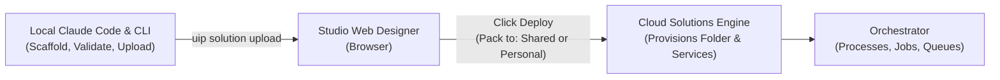
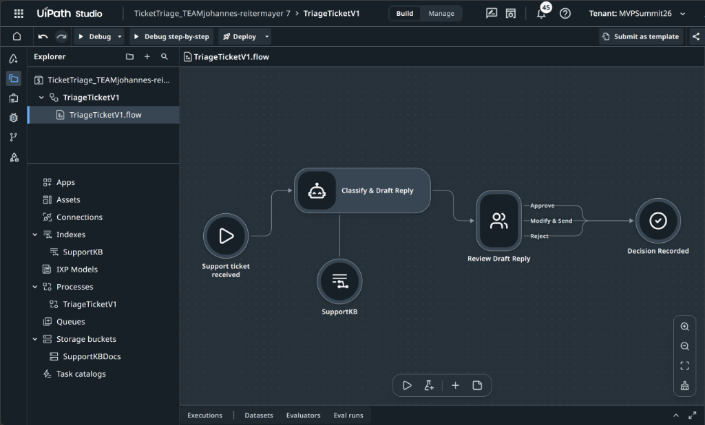
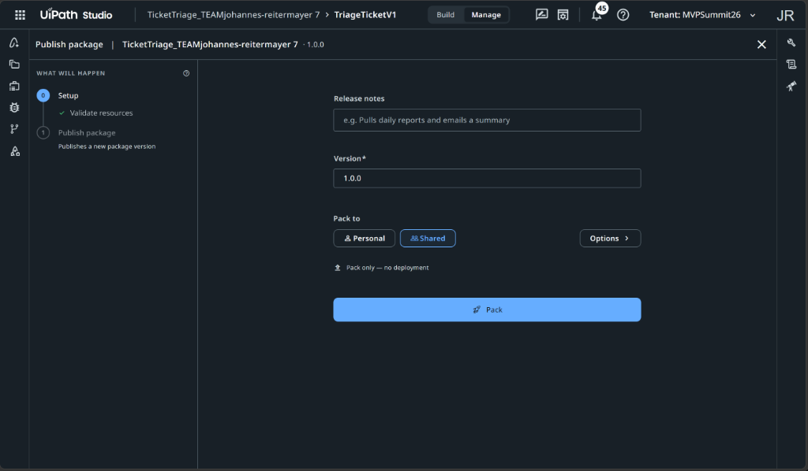
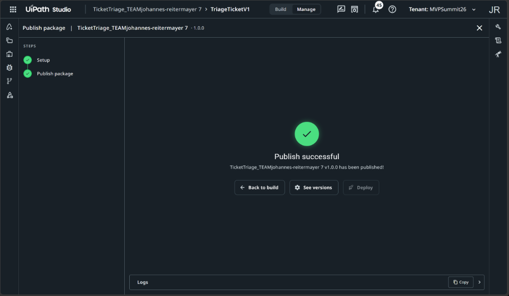
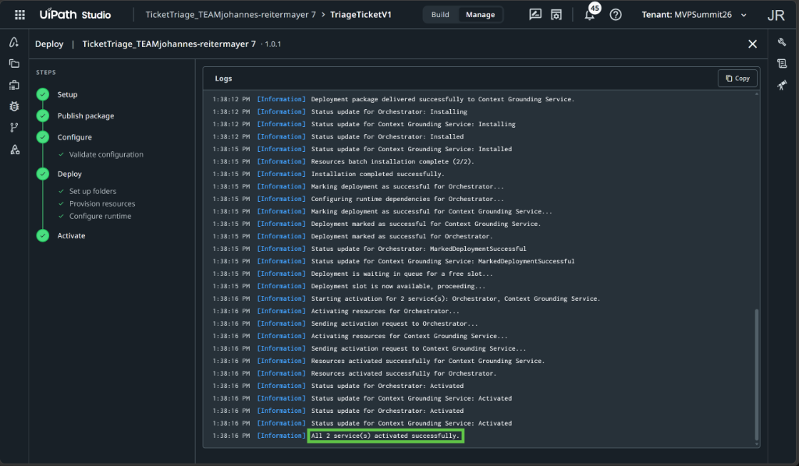
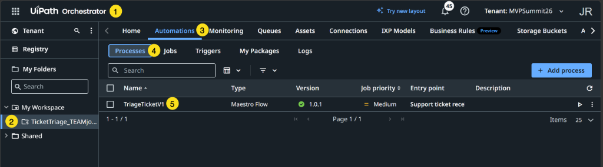
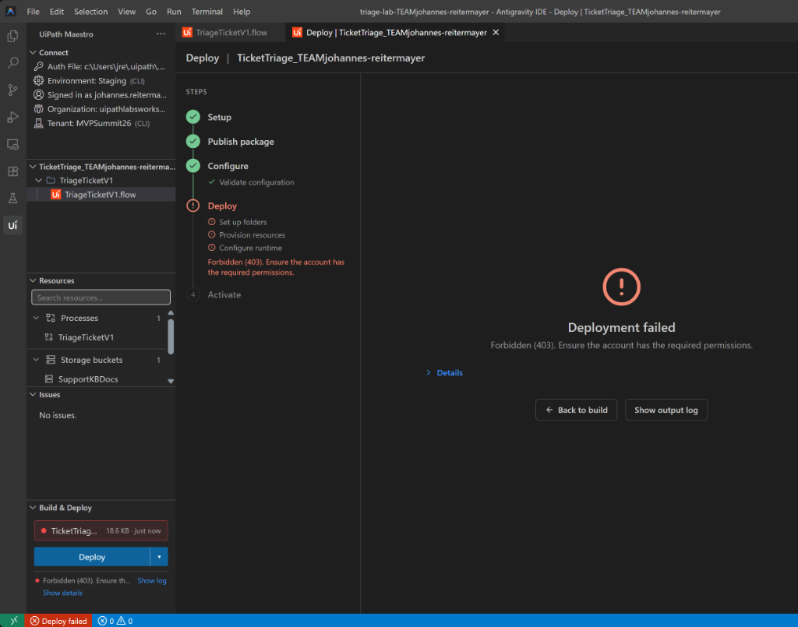

# Chapter 4: Deploy

> [!NOTE]
> **The Big Picture: Taking Code to the Cloud**  
> Code running only on a local developer laptop does not help the business. In this chapter, you complete the one browser step you will repeat across V1, V2, and V3: deploying from Studio Web. This compiles the solution, provisions your team folder, activates runtime services, and turns your flow into an executable Orchestrator process.

In this chapter, you deploy your first **UiPath Maestro Flow** solution (**`TicketTriage_TEAM<firstname>-<lastname>`**) from the Studio Web designer to Orchestrator.

This is what Product Manager Tuan highlights as **"the one browser step you will repeat three times today"** (for V1, V2, and V3). Deploying provisions your dedicated solution folder, compiles and publishes the solution package, links your shared knowledge base (`SupportKB`), and activates all runtime services.

| Step | Action | Description / Deliverable |
| :--- | :--- | :--- |
| **1. Inspect Canvas** | Verify Studio Web Canvas | Confirm flow nodes, inputs, and knowledge index in Studio Web |
| **2. Deploy Options** | Understand Target Environment | Compare deploying to **Shared** vs. **Personal Workspace** |
| **3. Deploy & Monitor** | Watch Real-Time Log | Monitor ~60-second log for *"All 2 service(s) activated successfully"* |
| **4. Checkpoint** | Verify in Orchestrator & CLI | Confirm process in Orchestrator and verify folder via `uip or folders list` |

---

## 1. Why Deployment Happens in the Browser

Throughout this workshop, almost all operations (resource queries, flow scaffolding, code editing, schema patching, and validation) are executed autonomously through **Claude Code** and the **UiPath CLI (`uip`)**.

However, deployment is intentionally performed in the **Studio Web browser designer**:



---

## 2. Step-by-Step Deployment Walkthrough

Follow these steps in your browser tab at [staging.uipath.com](https://staging.uipath.com):

### 2.1 Step 1: Open the Flow Designer in Studio Web

1. Open your browser tab containing **Studio Web**, or click the designer URL output by Claude Code at the end of Chapter 3:
   ```text
   https://staging.uipath.com/uipathlabsworkshop/studio_/designer/<flow-id>?solutionId=<solution-id>
   ```
2. Verify your canvas layout:
   - **Trigger Node:** `Support ticket received`
   - **Agent Node:** `Classify & Draft Reply`, connected to knowledge base `SupportKB`
   - **Review Task Node:** `Review Draft Reply` with three outcomes (`Approve`, `Modify & Send`, `Reject`)
   - **End Node:** `Decision Recorded`
3. Notice the top toolbar buttons: **Debug**, **Debug step-by-step**, and **Deploy**.



---

### 2.2 Step 2: Open the Deploy Wizard and Choose Target Environment

Click the **Deploy** button in the top toolbar to open the wizard modal.

> [!CAUTION]
> **Critical Workshop Finding: Permissions on the `Shared` Folder**
> In Tuan's slide instructions, attendees are told to switch **Pack to** from *Personal* to **Shared**.
> 
> However, on the workshop tenant (`MVPSummit26`), attendee accounts belong to the **`Automation Developers`** group. This group has fine-grained permissions that do **not** include `Folders.Create` on the root `Shared` folder.
> 
> When you select **Shared**, Studio Web recognizes that your account lacks folder creation rights in `Shared` and switches the button to **Pack only - no deployment**:



If you proceed with **Pack only**, the package publishes to the tenant feed, but the folder and runtime services are not deployed:



---

### 2.3 Step 3: Deploy to Personal Workspace (or Shared if Admin Configured)

To complete the full deployment including folder setup, resource provisioning, and runtime activation, you have two options depending on room configuration:

#### Option A: Deploy to Personal Workspace (Autonomous Path)
If tenant permissions on `Shared` have not been modified by a TA/Admin:
1. In the Deploy wizard, keep **Pack to** set to **Personal**.
2. Verify the **Version** field (e.g. `1.0.0`, or bump to `1.0.1` if `1.0.0` was already published).
3. Click the blue **Deploy** button.

#### Option B: Deploy to Shared (If TA/Admin Granted Permissions)
If the workshop administrator granted `Folders.Create` permissions to the `Automation Developers` group on the `Shared` folder:
1. Switch **Pack to** to **Shared**.
2. Verify the **Version** field (`1.0.1`).
3. Click **Deploy**.

---

### 2.4 Step 4: Monitor the Deployment Pipeline

1. Once **Deploy** is clicked, the deployment pipeline executes in real time (taking **45 to 60 seconds**).
2. The wizard displays live logs for all 5 stages:
   - **Setup:** Validates solution dependencies and resources.
   - **Publish package:** Delivers package to Context Grounding Service and Orchestrator.
   - **Configure:** Validates runtime configuration.
   - **Deploy:** Sets up dedicated solution folders and provisions resources.
   - **Activate:** Sends activation requests to Orchestrator and Context Grounding Service.
3. Watch the log until you see the confirmation message:
   ```text
   All 2 service(s) activated successfully.
   ```



---

## 3. Checkpoint & Verification

### 3.1 Visual Verification in Orchestrator

Navigate to **UiPath Orchestrator** in your browser (`https://staging.uipath.com/uipathlabsworkshop/MVPSummit26/orchestrator_`) to verify that your process is active:



Verify the 5 highlighted milestones:
1. **Tenant:** Ensure you are in tenant `MVPSummit26`.
2. **Folder Hierarchy:** In the left folder sidebar, locate your newly created team folder:
   - If deployed to Personal Workspace: under **My Folders > My Workspace > `TicketTriage_TEAM<firstname>-<lastname>`**.
   - If deployed to Shared: under **Shared > `TicketTriage_TEAM<firstname>-<lastname>`**.
3. **Automations Tab:** Click the **Automations** tab in the top navigation.
4. **Processes Subtab:** Click **Processes**.
5. **Active Process:** Confirm **`TriageTicketV1`** is listed with:
   - Type: `Maestro Flow`
   - Version: `1.0.1` (with a green checkmark)
   - Job Priority: `Medium`
   - Entry point: `Support ticket received`

---

### 3.2 Verification via UiPath CLI

You can also verify your deployment directly from your terminal or Claude Code session:

```text
! uip or folders list --limit 50
```

*Expected Output Sample:*
```json
{
  "Result": "Success",
  "Code": "FolderList",
  "Data": [
    {
      "Name": "TicketTriage_TEAMjohannes-reitermayer 7",
      "Path": "johannes.reitermayer@gmail.com's workspace/TicketTriage_TEAMjohannes-reitermayer 7",
      "Type": "Solution",
      "ParentKey": "3a9abdba-5525-4636-8d61-cc4e5efde96e"
    }
  ]
}
```

---

## 4. Troubleshooting & Breakage Guide

| Symptom / Error | Root Cause | Exact Fix |
| :--- | :--- | :--- |
| **Wizard shows "Pack only - no deployment" when selecting Shared** | Your account does not have `Folders.Create` permissions under the root `Shared` folder. | Switch **Pack to** to **Personal**. Your personal workspace gives you full solution folder creation rights, allowing the entire pipeline to activate cleanly. |
| **`Forbidden (403)` on *"Set up folders"* in Antigravity IDE / VS Code** | Deploy was initiated from the local editor extension using personal CLI credentials rather than Studio Web. | Do not use the local IDE Deploy button. Deploy via the **Studio Web browser designer** at `staging.uipath.com`. |
| **Publish fails with *"version already exists"*** | The version number (e.g. `1.0.0`) was already published during an earlier pack or publish attempt. | In the Deploy wizard, increment the **Version** field (e.g. from `1.0.0` to `1.0.1`) and click **Deploy** again. |
| **Deploy button is greyed out in Studio Web** | The knowledge index pointer was not written to the solution manifest during Chapter 3. | In Claude Code / terminal, run:<br/>`uip solution resources refresh`<br/>`uip solution upload`<br/>Then refresh your Studio Web browser tab. |

---

### Deep Dive: Understanding the `Forbidden (403)` Error in Local IDEs

When attempting to click **Deploy** inside the local Antigravity IDE or VS Code extension:



1. The local extension uses the attendee's personal OAuth CLI token to call Orchestrator API endpoints (`POST /odata/Folders`).
2. Because attendee accounts belong to the `Automation Developers` role without Orchestrator tenant administrator rights to create root-level standard/solution folders under `Shared`, Orchestrator rejects the folder setup step with:
   ```text
   Forbidden (403). Ensure the account has the required permissions.
   ```
3. In contrast, Studio Web in the browser manages the deployment lifecycle through the Cloud Solutions engine, and deploying into **Personal Workspace** guarantees that the folder and process are created without permission conflicts.

---

## 5. Next Steps

With your V1 triage flow successfully deployed and active in Orchestrator as **`TriageTicketV1`**, proceed to **Chapter 5** to test and execute your triage flow end-to-end against sample tickets!
