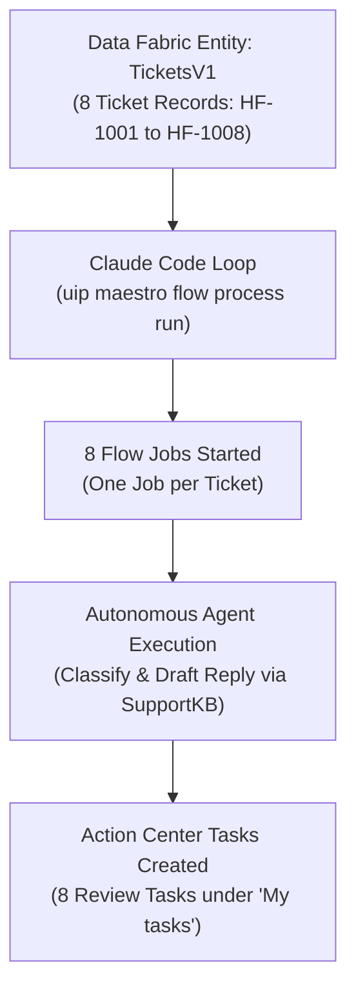
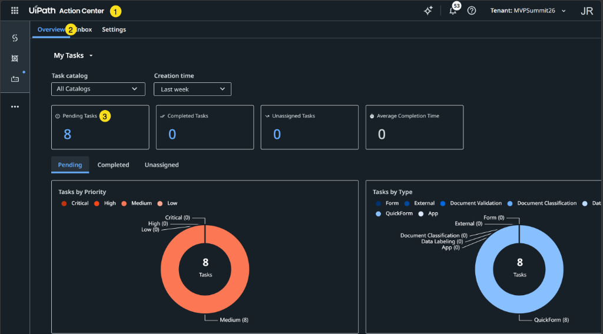
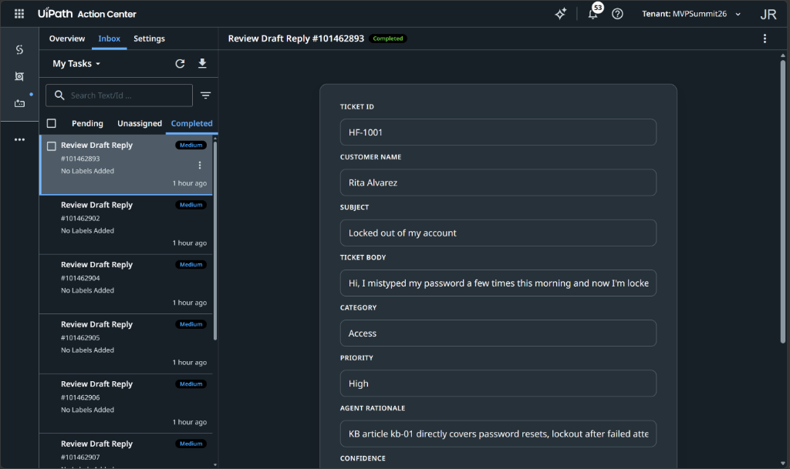

# Chapter 5: Run Batch A

> [!NOTE]
> **The Big Picture: The Robot Running**  
> With V1 live in the cloud, it is time to feed it real customer tickets. Claude Code reads 8 customer tickets from Data Fabric and launches 8 parallel flow jobs. In 45 seconds, the AI classifies the tickets, drafts grounded responses from `SupportKB`, and queues 8 review tasks in Action Center waiting for human judgment.

In this chapter, you instruct your AI coding agent (**Claude Code**) to execute your first batch of real customer support tickets from Data Fabric through your deployed **`TriageTicketV1`** flow.

You will query the 8 tickets stored in the shared **`TicketsV1`** entity, launch a flow job for each ticket using **`uip maestro flow process run`**, and verify that all 8 human review tasks appear in **Action Center** assigned directly to your user account.

| Step | Action | Description / Deliverable |
| :--- | :--- | :--- |
| **1. Parameter Discovery (Optional)** | Inspect Process & Ticket Keys | Optional peek under the hood at process keys and Data Fabric records |
| **2. Prompt Execution** | Send Run Batch A Prompt | Instruct Claude Code to launch all 8 jobs and monitor task creation |
| **3. Settlement Polling** | Understand Settlement Signal | Why the agent polls Action Center tasks rather than Orchestrator job state |
| **4. Checkpoint & Triage** | Verify & Review Action Center Tasks | Confirm 8 tasks under "My tasks" and follow triage guidelines for each decision |
| **5. Completed Inbox** | Verify Completed Tasks | Confirm triaged tasks transition to Completed with recorded decisions |

---

## 1. Overview & Execution Architecture

Unlike traditional RPA unattended background processes started via `uip or jobs start`, **UiPath Maestro Flows** are multi-stage orchestrations triggered via **`uip maestro flow process run`**.



---

## 2. Parameter Discovery: Flow Process & Data Fabric Records (Optional / Informational)

Before executing the batch, understand the two data sources your agent coordinates:

> [!TIP]
> **This Section is Optional:** You do not need to execute these inspection commands yourself. When you send the prompt in Section 3, Claude Code discovers the process keys and queries the Data Fabric tickets automatically. This section is provided so you understand what data sources your agent coordinates behind the scenes.

> [!IMPORTANT]
> **Key Naming Convention: Data Fabric Entities vs Maestro Flows**
> It is easy to confuse the flow names with the dataset names because both use V1, V2, and V3:
> - **`TicketsV1` / `TicketsV2` / `TicketsV3`**: These are the shared **Data Fabric Entities** (tables in Data Fabric holding 8 customer support tickets each).
> - **`TriageTicketV1` / `TriageTicketV2` / `TriageTicketV3`**: These are the **Maestro Flow Processes** (the automation workflows you build and deploy in Orchestrator).
>
> The flow does *not* query Data Fabric internally. Instead, Claude Code reads the 8 records from the shared Data Fabric entity (**`TicketsV1`**) and passes each record as input arguments into your deployed flow (**`TriageTicketV1`**).

### 2.1 Discover Deployed Process Keys

To start a Maestro Flow, three keys are required:
1. **`processKey`**: The dotted package identifier (e.g. `TicketTriage_TEAM<firstname>-<lastname>.7.flow.TriageTicketV1`).
2. **`folderKey`**: The unique identifier of the folder containing the process.
3. **`releaseKey`**: The process release identifier (`Key` in `uip or processes get`).

You can view these keys via the UiPath CLI:

```text
! uip or processes list
```

*Expected Output Sample:*
```json
{
  "Result": "Success",
  "Code": "ProcessList",
  "Data": [
    {
      "Name": "TriageTicketV1",
      "ProcessKey": "TicketTriage_TEAMjohannes-reitermayer.7.flow.TriageTicketV1",
      "ProcessVersion": "1.0.1",
      "FolderKey": "f15d2bb8-1c03-4408-a5d2-2a9c2b244ed9",
      "Key": "98652ce8-e7dc-412c-b0e6-f275b99c0571"
    }
  ]
}
```

---

### 2.2 Query Tickets from Data Fabric (`TicketsV1`)

In [Chapter 2 (Section 3)](2-Preflight.md#3-first-prompt-verify-shared-workshop-resources), Claude Code verified during the preflight check that the shared entity **`TicketsV1`** exists and holds 8 records.

Before executing the batch, you can inspect the actual ticket records yourself from the terminal to see what fields your flow will process.

The UiPath CLI command `uip df records list <id>` strictly requires the entity's unique **UUID (`Id`)**, rather than its human-readable display name string (`TicketsV1`). You can inspect the records using either dynamic discovery or direct ID:

#### Method A: Dynamic Query by Entity Name (Recommended)
Use built-in JMESPath filtering (`--output-filter`) to resolve the entity ID dynamically and query its records in a single command without hardcoding any GUID:

- **Bash / Zsh (macOS / Linux):**
  ```bash
  ! uip df records list $(uip df entities list --include-folders --output-filter "[?Name=='TicketsV1'].Id | [0]" --output plain)
  ```

- **PowerShell (Windows):**
  ```powershell
  ! uip df records list (uip df entities list --include-folders --output-filter "[?Name=='TicketsV1'].Id | [0]" --output plain)
  ```

> [!TIP]
> Append `--output table` to the end of either command to render the records in an easy-to-read tabular format.

#### Method B: Direct Query via Resolved Entity ID
On the workshop tenant (`uipathlabsworkshop/MVPSummit26`), `TicketsV1` was assigned entity ID `8d3f6ef9-37a4-f111-9b32-000d3a69a13b`:

```text
! uip df records list 8d3f6ef9-37a4-f111-9b32-000d3a69a13b
```

> [!NOTE]
> **How Claude Code Queries Dynamically:**
> When you run the batch prompt in Section 3, you do not need to provide the entity GUID. Claude Code automatically calls `uip df entities list`, matches `Name == 'TicketsV1'`, extracts its `Id`, and fetches all 8 records dynamically.

Each record contains the 4 fields expected by `TriageTicketV1`:
- **`TicketId`**: Unique ticket identifier (`HF-1001` through `HF-1008`).
- **`Subject`**: Summary line (e.g. *"Locked out of my account"*).
- **`Body`**: The full customer inquiry.
- **`CustomerName`**: Customer's full name or email address.

---

## 3. The Run Batch A Prompt

Ensure your terminal is inside your interactive **Claude Code** session.

### Option 1: Tuan's Original Slide Baseline
```text
Run every ticket in the shared TicketsV1 entity through my deployed flow, one job each. Flows start with uip maestro flow process run <processKey> <folderKey> --release-key <releaseKey>, not with jobs start. The batch is settled when every instance is either Completed or has an open Action Center task - check that, don't wait on job state.
```

### Option 2: Optimized Prompt (Recommended)
This version instructs Claude Code to dynamically discover your deployed process keys and inspect Data Fabric automatically:

```text
Discover my deployed flow process TriageTicketV1 using uip or processes list to get its processKey, folderKey, and releaseKey (Key). Query all 8 ticket records from the shared Data Fabric entity TicketsV1 (extracting ticketId, subject, body, customerName). Run every ticket through the flow using uip maestro flow process run <processKey> <folderKey> --release-key <releaseKey> --inputs '{"ticketId":"...","subject":"...","body":"...","customerName":"..."}'. The batch is settled when every instance is either Completed or has an open Action Center task (poll uip tasks list until 8 tasks are open or instances reach the review node; do not poll job state). Report the job keys, execution progress, and task confirmation.
```

> [!TIP]
> **Why the Optimized Prompt Works Best:**
> 1. **Zero manual GUID lookups:** Claude Code inspects `uip or processes list` and extracts `processKey`, `folderKey`, and `releaseKey` automatically.
> 2. **Dynamic inputs mapping:** Reads each record from `TicketsV1` and constructs clean JSON `--inputs` payloads.
> 3. **Settlement polling guardrail:** Explicitly directs the agent to poll `uip tasks list`, preventing it from hanging on Orchestrator job state.

---

## 4. What the Agent Executes Behind the Scenes

While the agent runs (typically taking **60 to 90 seconds**), Claude Code performs the following sequence:

### 4.1 Job Dispatch Loop
For each of the 8 tickets (`HF-1001` through `HF-1008`), Claude Code executes:
```bash
uip maestro flow process run <processKey> <folderKey> --release-key <releaseKey> --inputs '{"ticketId":"HF-1001","subject":"...","body":"...","customerName":"..."}'
```
Orchestrator queues each job and returns an execution confirmation:
```json
{
  "Result": "Success",
  "Code": "FlowJobStarted",
  "Data": {
    "JobKey": "65241d8c-5a0c-416c-9324-9714fd00e59e",
    "State": "Pending"
  }
}
```

---

### 4.2 The Crucial Signal: Why Polling Job State Fails

> [!IMPORTANT]
> **Understanding Maestro Flow Job Lifecycle**
> In UiPath Orchestrator, when a Maestro Flow job reaches a Human-in-the-Loop task node (`reviewDraftReply1`), the job remains in **`Running`** status while it waits for a human reviewer.
> 
> If an AI agent polls `uip or jobs get`, it will see `Status: Running` and continue waiting for 5+ minutes, falsely reporting that the batch is "still running" even though the review tasks were created in the first 30 seconds!
> 
> **The Real Signal:** The batch is considered settled as soon as all **8 tasks appear in Action Center** (or instances reach the human review stage).

---

## 5. Checkpoint & Verification

### 5.1 Verification Checklist
Ensure the following milestones are met:
- **8 jobs started** in Orchestrator (one job per ticket).
- **8 review tasks created** in Action Center within **60 to 90 seconds**.
- All tasks are assigned to **your email address** (showing under **"My tasks"**, not *"Unassigned"*).
- Measured runtime benchmark: 20-50 seconds per job from start to task creation.

---

### 5.2 Verify via UiPath CLI

You can verify that all 8 tasks exist and are assigned to you by querying Action Center from Claude Code or your terminal:

```text
! uip tasks list
```

*Expected Output Sample:*
```text
Total tasks created: 8
Task 101462893: Title="Review Draft Reply", Status=Pending, AssignedTo=user@example.com
Task 101462902: Title="Review Draft Reply", Status=Pending, AssignedTo=user@example.com
Task 101462904: Title="Review Draft Reply", Status=Pending, AssignedTo=user@example.com
Task 101462905: Title="Review Draft Reply", Status=Pending, AssignedTo=user@example.com
Task 101462906: Title="Review Draft Reply", Status=Pending, AssignedTo=user@example.com
Task 101462907: Title="Review Draft Reply", Status=Pending, AssignedTo=user@example.com
Task 101462908: Title="Review Draft Reply", Status=Pending, AssignedTo=user@example.com
Task 101462909: Title="Review Draft Reply", Status=Pending, AssignedTo=user@example.com
```

---

### 5.3 Verify in Action Center (Browser)

Follow these steps to navigate to Action Center and verify your pending tasks:

1. **Navigate to Action Center:**
   In your browser at [staging.uipath.com](https://staging.uipath.com), click the **Product Launcher** (9-dot menu in the top navigation) and select **Action Center** (Marker 1).

2. **Inspect the Overview Dashboard:**
   Action Center opens to the **Overview** tab (Marker 2).

3. **Confirm 8 Pending Tasks:**
   Check the summary KPI tiles (Marker 3):
   - **Pending Tasks: 8** confirms that all 8 flow jobs successfully generated review tasks.
   - **Unassigned Tasks: 0** confirms that every task was assigned directly to your account (`user@example.com`), rather than falling into an unassigned pool.
   - The **Tasks by Type** donut chart confirms all 8 items are interactive `QuickForm` tasks.



4. **Navigate to the Inbox:**
   Click the **Inbox** tab in the top navigation (next to Overview) or click directly on the **8 Pending Tasks** card.

5. **Open a Task to Review:**
   Under **My Tasks**, select any task titled **"Review Draft Reply"** to load the form:
   - **Customer Context:** Review `TicketId`, `CustomerName`, `Subject`, and `Body`.
   - **AI Assessment:** Inspect the AI category, priority, rationale, and confidence score.
   - **Draft Reply:** Review the proposed reply generated from `SupportKB`.
   - **Action Buttons:** Choose between **Approve**, **Modify & Send**, or **Reject**.

---

### 5.4 Triage Decision Guide: Reviewing Batch A

When reviewing each task in Action Center, evaluate the AI draft against the customer inquiry.

> [!IMPORTANT]
> **Student Action Required: Do NOT Blindly Click "Approve" 8 Times!**  
> Switch to your browser tab at Action Center. You must review all 8 tasks under **My Tasks** individually:
> - **4 Inquiries to Approve (`HF-1001` through `HF-1004`):** These have accurate KB grounding. Click **Approve**.
> - **3 Inquiries to Modify & Send (`HF-1005`, `HF-1006`, `HF-1007`):** The AI draft missed critical operational details or SLAs. **Edit the draft in the form** (copy the suggested text from the table below), then click **Modify & Send**.
> - **1 Inquiry to Reject (`HF-1008`):** This is automated vendor out-of-office noise. Click **Reject** so no reply is sent.
> 
> These 8 human decisions establish your **Baseline Score: 8 human touches for 8 tickets (100% human touch rate)**. In Chapters 7–11, you will teach the agent to automate clear cases and cut human touches drastically.

Below is the recommended triage decision, rationale, and exact modified draft for each ticket:

| Task ID | Ticket ID | Customer & Subject | AI Conf | Decision | Suggested Action / Modified Draft Text | Rationale |
| :--- | :--- | :--- | :--- | :--- | :--- | :--- |
| **`101462893`** | **HF-1001** | Rita Alvarez<br/>*Locked out of my account* | **96%** | **Approve** | *(No modification required)*<br/>Keep original AI draft: self-service reset instructions at `reset.homefixsupply.com` and Service Desk ext 4357 fallback. | Grounded in KB `kb-01`. All password reset parameters and unlock timelines are accurate. |
| **`101462902`** | **HF-1002** | Marcus Webb<br/>*VPN stuck on Connecting from hotel* | **93%** | **Approve** | *(No modification required)*<br/>Keep original AI draft: PanGPS service restart, reboot, and mobile hotspot workaround. | Strong KB grounding for GlobalProtect troubleshooting on captive hotel networks. |
| **`101462904`** | **HF-1003** | Priya Nair<br/>*Duplicate charge showing in Concur* | **96%** | **Approve** | *(No modification required)*<br/>Keep original AI draft: mark "Disputed - duplicate" in Concur, do not contact bank, automatic reversal in 3 days. | Perfectly complies with corporate expense policy. |
| **`101462907`** | **HF-1004** | Jonah Kim<br/>*Two questions: monitor & guest wifi* | **92%** | **Approve** | *(No modification required)*<br/>Keep original AI draft: hardware catalog link for dock + up to 2 monitors; `wifi.homefixsupply.com/guest` with 5-day sponsor extension. | Cleanly addresses both unrelated questions in one unified, accurate response. |
| **`101462906`** | **HF-1005** | Elena Petrova<br/>*Connect NetSuite to inventory API* | **73%** | **Modify & Send** | **Edit draft in form before sending:**<br/>`"Hello Elena, thank you for reaching out regarding NetSuite integration with our inventory API. I have escalated this directly to our Integration Architecture team (ticket INT-4810). A solutions architect will reach out within 2 business days with the OpenAPI spec, sandbox credentials, and rate limit tiers (standard tier is 100 req/min). Best regards, HomeFix Enterprise Architecture"` | KB lacks API integration documentation. The AI correctly escalated, but adding concrete SLA and architecture details provides a professional experience. |
| **`101462905`** | **HF-1006** | Dave Okafor<br/>*URGENT: Rotterdam DC scanners down* | **72%** | **Modify & Send** | **Edit draft in form before sending:**<br/>`"Hi Dave, PRIORITY ESCALATION: We have logged this as Severity 1 (Incident INC-9042) and paged the Rotterdam on-call network engineer and DC site lead immediately. Please instruct dock teams to switch to manual paper manifests as per BCP SOP-04 while network diagnostics are underway. The bridge line is open at ext 4357 (PIN: 8821). We will provide an update within 15 minutes. HomeFix Critical Incident Response Team"` | **Urgent warehouse operational stoppage** (trucks waiting at dock). A passive "we have no KB article" draft must be upgraded to active crisis response. |
| **`101462908`** | **HF-1007** | Sandra Mills<br/>*Third delay on laptop replacement* | **86%** | **Modify & Send** | **Edit draft in form before sending:**<br/>`"Dear Sandra, I sincerely apologize for the multiple delays on your replacement laptop, especially given the disruption to your customer calls. I have taken personal ownership of this ticket (HW-3321 / HW-3398). I have authorized an expedited courier shipment for a pre-imaged loaner laptop arriving tomorrow by 10:00 AM. You will receive tracking details shortly. Best regards, IT Support Lead"` | Customer is threatening to escalate to the CIO. Needs personal empathy, immediate ownership, and an expedited tracking commitment. |
| **`101462909`** | **HF-1008** | auto-reply@vendormail.example<br/>*Out of Office Re: Your order* | **87%** | **Reject** | **Action: Click Reject button.**<br/>Do not send any reply to this automated vendor out-of-office message. Rejecting the task closes the review loop without triggering an email ping-pong loop. | Automated vendor out-of-office bounce. Not a real IT support inquiry; must never receive an automated reply. |

---

## 6. Troubleshooting & Breakage Guide

| Symptom / Error | Root Cause | Exact Fix |
| :--- | :--- | :--- |
| **`Couldn't find any user with unattended robot permissions`** | The folder lacks an assigned unattended robot account or runtime license. | On workshop tenants, robot accounts are inherited from the parent folder. If this occurs, notify a workshop TA to assign an unattended runtime to your folder. |
| **Agent loops for 5+ minutes reporting *"still running"*** | The agent is polling Orchestrator job state instead of Action Center tasks. | Stop the agent (`Ctrl + C`) and prompt: *"Stop polling jobs. Check uip tasks list to verify how many Action Center tasks have been created."* |
| **Tasks appear under *"Unassigned"* instead of *"My tasks"*** | The assignee expression in the Quick Form task was not resolved to your email address during Chapter 3. | The task can still be claimed manually by clicking **Assign to me** in Action Center. |

---

## 7. Completed Batch A in Action Center

Once you have reviewed and submitted your decisions for the tickets, they transition from **Pending** to **Completed**:



### Key Milestones & Audit Trail:
1. **Inbox > Completed Tab:** Triaged tasks move out of the Pending queue and appear under the **Completed** tab in **My Tasks**.
2. **Completed Status Badge:** Selecting any task (such as `#101462893` for `HF-1001`) displays the green **Completed** status badge next to the task title.
3. **Audit Trail & Captured Decisions:** The completed card preserves the original customer context (`TicketId`, `CustomerName`, `Subject`, `Body`), the classification (`Access`), priority (`High`), rationale, and the final decision approved by the human reviewer.
4. **Flow Completion:** In Orchestrator, the corresponding flow instance resumes from its suspended state, executes the End node, and records the final outcome in the execution history.

---

## 8. Next Steps

With Batch A fully triaged, modified, and completed through Action Center, your V1 flow has executed its first complete human-in-the-loop lifecycle. Proceed to **Chapter 6**!
