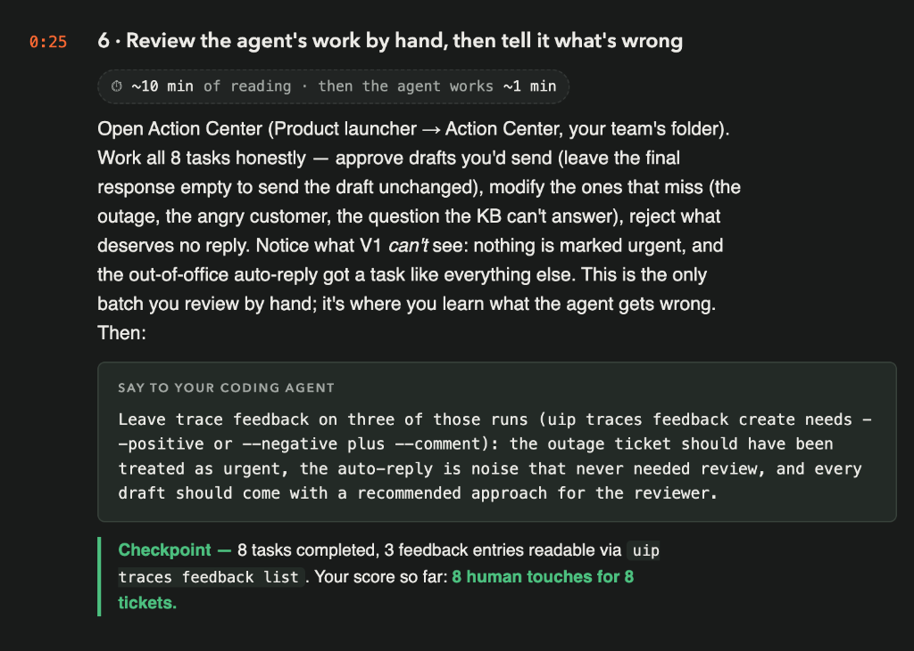
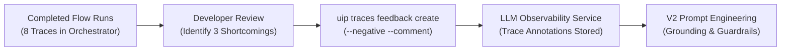

# Chapter 6: Review the Agent's Work by Hand, Then Tell It What's Wrong

> [!NOTE]
> **The Big Picture: The Human Grading the Robot**  
> In Chapter 5, the robot ran; in Chapter 6, you grade the robot. You review all 8 tickets by hand, discover the three critical blind spots of V1 (urgency blindness, auto-reply noise, and passive drafts), establish the baseline score of 8 human touches for 8 tickets, and teach the agent what went wrong using LLM Observability trace feedback.

In this chapter, you review the agent's triage decisions from Batch A by hand in **Action Center**, observe what V1 gets wrong, and instruct your AI coding agent (**Claude Code**) to leave **LLM Observability Trace Feedback** on three specific runs using **`uip traces feedback create`**.



| Step | Action | Description / Deliverable |
| :--- | :--- | :--- |
| **1. Manual Review** | Work 8 Tasks in Action Center | Approve good drafts, modify edge cases, and reject auto-reply noise |
| **2. Observe Shortcomings** | Analyze V1 Limitations | Note lack of urgency detection, vendor noise, and missing reviewer guidance |
| **3. Trace Feedback Prompt** | Send Trace Feedback Prompt | Instruct Claude Code to record negative feedback annotations on 3 runs |
| **4. Checkpoint** | Verify Feedback in CLI | Confirm 8 tasks completed and 3 feedback entries readable via `uip traces feedback list` |

---

## 1. Overview & Learning Objectives

This is the **only batch** in the workshop that you review completely by hand.

The purpose of manual review is not merely operational verification; it is pedagogical. By reviewing all 8 tickets yourself, you experience firsthand what V1 **can** do and what it **cannot** do:

1. **What V1 Does Well:**
   - For standard inquiries with direct knowledge base matches (password reset, VPN troubleshooting, duplicate expenses), V1 produces accurate classifications and helpful draft responses grounded in `SupportKB`.
2. **What V1 Gets Wrong (The Gaps):**
   - **No Urgency Detection:** The Rotterdam DC scanner failure (`HF-1006`) stopped distribution outbound loading with trucks waiting at the dock. V1 classified it as standard priority and drafted a passive "we have no KB procedure" response instead of flagging it as an emergency.
   - **No Noise Filtering:** An automated vendor out-of-office message (`HF-1008`) was treated like a genuine customer ticket and created a human review task in Action Center.
   - **No Reviewer Guidance:** When an angry customer threatened to escalate to the CIO (`HF-1007`), the agent provided no recommendation to the human reviewer on what action to take (e.g. approve an expedited loaner laptop).
3. **The Baseline Score:**
   - In Batch A, humans had to touch **every single ticket**: **8 human touches for 8 tickets** (a 100% human touch rate).
   - In future chapters, you will teach the agent to automate clear cases and cut human touches drastically.

---

## 2. The Manual Review Experience in Action Center

In Chapter 5, you opened Action Center and reviewed each of the 8 tasks under **My Tasks**:


### The Three Decision Paths:
- **Approve (4 tickets):** For tickets with strong KB grounding (`HF-1001`, `HF-1002`, `HF-1003`, `HF-1004`), clicking **Approve** leaves the draft unchanged and sends it as the final response.
- **Modify & Send (3 tickets):** For tickets that miss the mark (`HF-1005`, `HF-1006`, `HF-1007`), editing the `draftReply` text area allows you to inject emergency escalation instructions, SLAs, or empathetic commitments before clicking **Modify & Send**.
- **Reject (1 ticket):** For automated vendor out-of-office noise (`HF-1008`), clicking **Reject** closes the review loop without sending any email, preventing an infinite auto-reply loop.

Once all 8 tasks are submitted, they transition to the **Completed** tab in your Action Center Inbox.

---

## 3. Teaching the Agent: LLM Observability Trace Feedback

In modern agentic automation, when an AI model makes a mistake, you do not rewrite code immediately. Instead, you record **trace feedback** directly against the execution trace in UiPath's **LLM Observability** service.



### What `uip traces feedback create` Does:
1. **Trace Association:** Links your qualitative review comment to the specific execution run (`TraceId` / `JobKey`).
2. **Polarity Flag:** Marks the run as `--positive` (reinforcing good behavior) or `--negative` (highlighting errors).
3. **Auditability:** Stores the feedback in the folder's LLM Observability database, making it queryable via `uip traces feedback list` and visible to evaluation frameworks.

---

## 4. The Chapter 6 Prompts

Ensure your terminal is inside your interactive **Claude Code** session.

### Option 1: Tuan's Original Slide Baseline
```text
Leave trace feedback on three of those runs (uip traces feedback create needs --positive or --negative plus --comment): the outage ticket should have been treated as urgent, the auto-reply is noise that never needed review, and every draft should come with a recommended approach for the reviewer.
```

### Option 2: Optimized Prompt (Recommended)
This version instructs Claude Code to inspect your completed flow jobs, extract the exact trace IDs, apply your folder key, and verify the feedback entries:

```text
Inspect my completed flow jobs for TriageTicketV1 in folder f15d2bb8-1c03-4408-a5d2-2a9c2b244ed9 to identify the trace IDs (job keys) for the Rotterdam DC outage (HF-1006), the vendor out-of-office auto-reply (HF-1008), and the escalating laptop replacement (HF-1007). Create negative trace feedback on all three runs using uip traces feedback create --folder-key f15d2bb8-1c03-4408-a5d2-2a9c2b244ed9 --trace-id <traceId> --negative --comment "...":
1. For HF-1006: "The outage ticket should have been treated as urgent. A warehouse scanning stoppage with trucks waiting at the dock requires urgent handling and immediate escalation, not standard triage."
2. For HF-1008: "The auto-reply is noise that never needed review. Automated vendor out-of-office notifications should be filtered out upfront and never create Action Center review tasks."
3. For HF-1007: "Every draft should come with a recommended approach for the reviewer. When a customer threatens escalation, the agent should propose an explicit action (e.g. approve expedited loaner) instead of a passive draft."
Then list the feedback entries using uip traces feedback list --folder-key f15d2bb8-1c03-4408-a5d2-2a9c2b244ed9 to verify the checkpoint.
```

> [!TIP]
> **Why the Optimized Prompt Works Best:**
> 1. **Auto-Resolves Trace IDs:** Maps each ticket (`HF-1006`, `HF-1008`, `HF-1007`) to its exact 32-character hexadecimal trace ID from the execution jobs.
> 2. **Passes `--folder-key`:** The `uip traces feedback create` API requires `--folder-key` for write operations; the optimized prompt guarantees it is included.
> 3. **Autonomous Verification:** Concludes with `uip traces feedback list` to verify the checkpoint without requiring a second prompt.

---

## 5. What the Agent Executes Behind the Scenes

While the agent runs (typically taking **~1 minute**), Claude Code performs the following commands:

### 5.1 Feedback 1: Rotterdam DC Outage (`HF-1006`)
```bash
uip traces feedback create \
  --trace-id 9a93a55b61404d6c9860a5549755490f \
  --negative \
  --comment "The outage ticket should have been treated as urgent. A warehouse scanning stoppage with trucks waiting at the dock requires urgent handling and immediate escalation, not standard triage." \
  --folder-key f15d2bb8-1c03-4408-a5d2-2a9c2b244ed9
```

### 5.2 Feedback 2: Vendor Out-of-Office Auto-Reply (`HF-1008`)
```bash
uip traces feedback create \
  --trace-id dca71319f9164e57baa2431f08a0fd1c \
  --negative \
  --comment "The auto-reply is noise that never needed review. Automated vendor out-of-office notifications should be filtered out upfront and never create Action Center review tasks." \
  --folder-key f15d2bb8-1c03-4408-a5d2-2a9c2b244ed9
```

### 5.3 Feedback 3: Reviewer Recommendation (`HF-1007`)
```bash
uip traces feedback create \
  --trace-id 351f0d47119b4d5c96951cf985274f33 \
  --negative \
  --comment "Every draft should come with a recommended approach for the reviewer. When a customer threatens escalation, the agent should propose an explicit action (e.g. approve expedited loaner) instead of a passive draft." \
  --folder-key f15d2bb8-1c03-4408-a5d2-2a9c2b244ed9
```

---

## 6. Checkpoint & Verification

### 6.1 Verification Checklist
Ensure the following milestones are confirmed:
- **8 tasks completed** in Action Center (all 8 tasks transitioned to the Completed tab).
- **3 trace feedback entries** recorded in LLM Observability.
- **Your score so far: 8 human touches for 8 tickets.**

---

### 6.2 Verify Feedback via UiPath CLI

In Claude Code or your PowerShell terminal, execute:

```text
! uip traces feedback list --folder-key f15d2bb8-1c03-4408-a5d2-2a9c2b244ed9
```

*Expected Output Sample:*
```json
{
  "Result": "Success",
  "Code": "FeedbackList",
  "Data": [
    {
      "Id": "76c2e2d8-bc2f-4277-af9a-df89d643d970",
      "TraceId": "351f0d47-119b-4d5c-9695-1cf985274f33",
      "Comment": "Every draft should come with a recommended approach for the reviewer. When a customer threatens escalation, the agent should propose an explicit action (e.g. approve expedited loaner) instead of a passive draft.",
      "IsPositive": false,
      "FolderKey": "f15d2bb8-1c03-4408-a5d2-2a9c2b244ed9",
      "UserEmail": "johannes.reitermayer@gmail.com"
    },
    {
      "Id": "33753ae0-b644-4b3c-b073-7e7cb7b0893e",
      "TraceId": "dca71319-f916-4e57-baa2-431f08a0fd1c",
      "Comment": "The auto-reply is noise that never needed review. Automated vendor out-of-office notifications should be filtered out upfront and never create Action Center review tasks.",
      "IsPositive": false,
      "FolderKey": "f15d2bb8-1c03-4408-a5d2-2a9c2b244ed9",
      "UserEmail": "johannes.reitermayer@gmail.com"
    },
    {
      "Id": "75c053c0-65b8-43b7-af43-c98ab1b2b1e4",
      "TraceId": "9a93a55b-6140-4d6c-9860-a5549755490f",
      "Comment": "The outage ticket should have been treated as urgent. A warehouse scanning stoppage with trucks waiting at the dock requires urgent handling and immediate escalation, not standard triage.",
      "IsPositive": false,
      "FolderKey": "f15d2bb8-1c03-4408-a5d2-2a9c2b244ed9",
      "UserEmail": "johannes.reitermayer@gmail.com"
    }
  ]
}
```

---

## 7. Troubleshooting & Breakage Guide

| Symptom / Error | Root Cause | Exact Fix |
| :--- | :--- | :--- |
| **`--folder-key is required`** | The write operation `feedback create` was invoked without specifying the Orchestrator folder. | Add `--folder-key <yourFolderKey>` (e.g. `f15d2bb8-1c03-4408-a5d2-2a9c2b244ed9`) to the command. |
| **`Feedback not found (404)`** | The `--trace-id` passed does not match an active execution trace in the folder (e.g. using a mismatched Job GUID). | Inspect `uip tasks data get <taskId>` to retrieve the exact `CreatorJobKey`, and use that key (with or without hyphens) as the `--trace-id`. |
| **`Either --positive or --negative is required`** | The command omitted the feedback polarity flag. | Add either `--positive` or `--negative` to declare whether the trace demonstrated desired or undesired behavior. |

---

## 8. Next Steps

With your feedback formally recorded in LLM Observability, you have documented the three core deficiencies of V1. Proceed to **Chapter 7** to build **V2**, incorporating prompt engineering, urgency detection, and automated noise filtering to improve your automation score!
