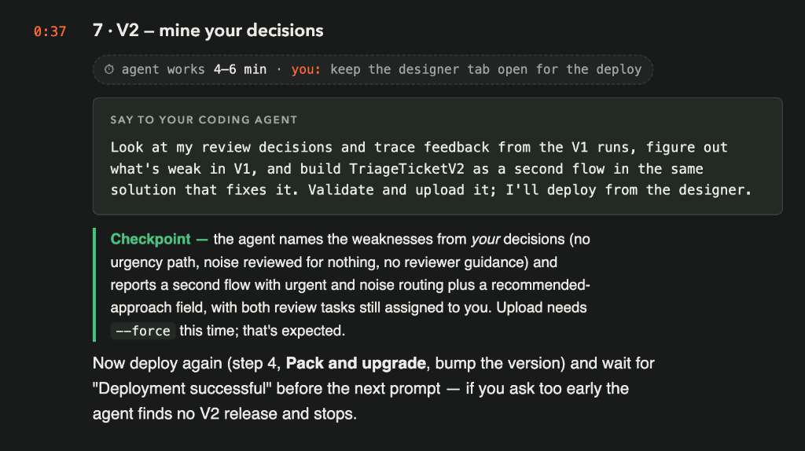
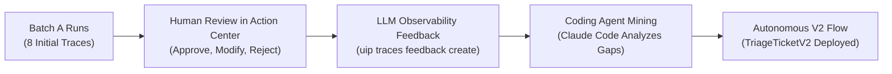
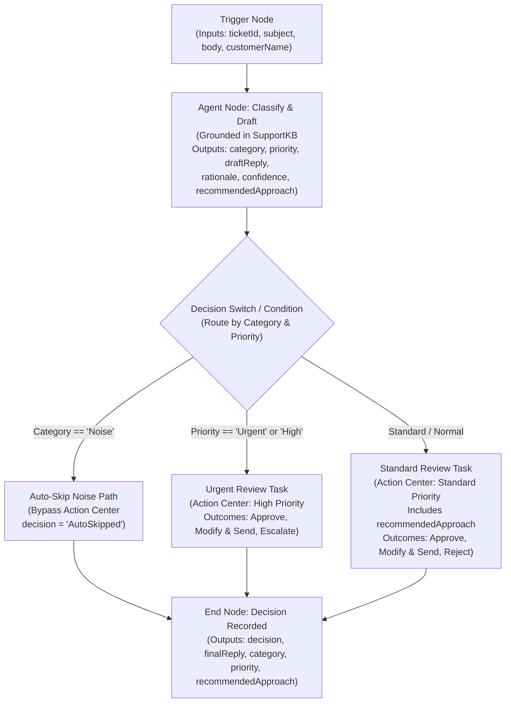
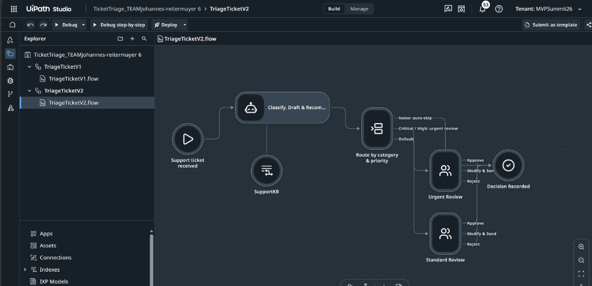
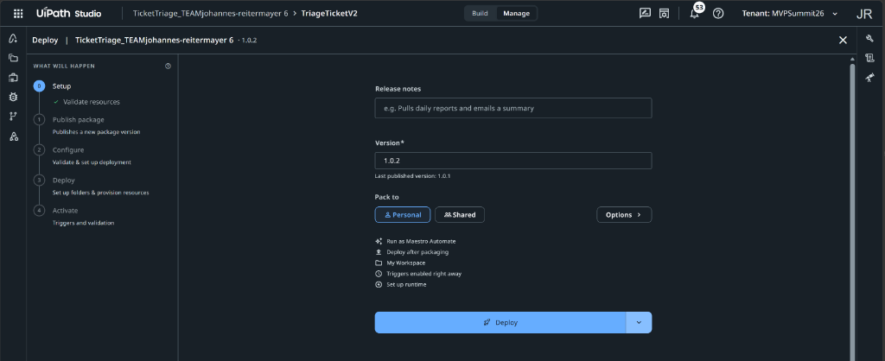
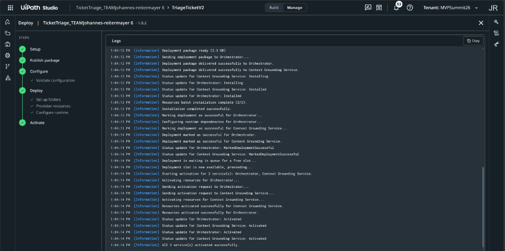

# Chapter 7: V2 - Mine Your Decisions

> [!NOTE]
> **The Big Picture: Mining Decisions to Evolve V2**  
> In Chapter 6, you reviewed 8 tickets by hand and logged LLM Observability trace feedback on the flaws of V1. Now, you close the loop. Instead of writing complex workflow routing rules from scratch, you instruct Claude Code to mine your human review decisions and trace feedback. The agent extracts the three operational weaknesses and restructures the workflow into **three intelligent routing paths**:
> 
> 1. **The Noise Path (Auto-Skip):** Automated vendor out-of-office notifications bypass Action Center entirely and route straight to the End node (0 human touches, eliminating reviewer fatigue and infinite email ping-pong loops).
> 2. **The Urgent Path (Fast-Track):** Critical operational emergencies (such as warehouse scanner outages halting freight trucks) are fast-tracked into a dedicated Urgent Review task with high priority.
> 3. **The Standard Path (Guided Review):** Routine support inquiries route to a Standard Review task displaying an editable draft reply alongside a new AI-generated `recommendedApproach` field grounded in the SupportKB to guide human reviewers on the best course of action.
> 
> All three paths converge cleanly at the End node, and Claude Code uploads `TriageTicketV2` as a second flow inside your existing solution.

In this chapter, you instruct your AI coding agent (**Claude Code**) to inspect your manual review outcomes and LLM Observability trace feedback from Batch A, identify the operational gaps of V1, and construct **`TriageTicketV2`** as a second flow within your existing solution (**`TicketTriage_TEAM<firstname>-<lastname>`**).



| Step | Action | Description / Deliverable |
| :--- | :--- | :--- |
| **1. Analyze Feedback** | Mine Human Decisions | Extract the 3 weaknesses: urgency blindness, noise waste, and missing reviewer guidance |
| **2. Build V2 Prompt** | Send V2 Generation Prompt | Instruct Claude Code to scaffold and wire `TriageTicketV2` in the same solution |
| **3. Force Upload** | Upload Solution with `--force` | Synchronize the updated multi-flow solution into Studio Web |
| **4. Pack & Upgrade** | Deploy from Studio Web Designer | Bump version to `1.0.2`, click Deploy, and wait for "Deployment successful" |
| **5. Checkpoint** | Verify Deployed Process | Confirm `TriageTicketV2` process release is active in Orchestrator before proceeding |

---

## 1. Overview & The "Mining Decisions" Paradigm

In traditional automation, evolving a process requires weeks of business analysis: interviewing operations teams, gathering change requests, and manually re-architecting routing trees.

Agentic automation inverts this lifecycle:



1. **Human Decisions as Training Data:** Your manual decisions in Action Center (approving, modifying, rejecting) represent ground truth operational policy.
2. **Trace Annotations as Guardrails:** Your qualitative comments in LLM Observability pinpoint exact model deficiencies.
3. **Autonomous Architecture Evolution:** Claude Code reads the execution traces and annotations, extracts the structural requirements, and authors the second-generation flow (`TriageTicketV2`) autonomously.

---

## 2. Analysis of V1 Weaknesses (The Three Gaps)

When Claude Code inspects your Chapter 6 review decisions and trace feedback, it identifies three critical flaws in the V1 baseline:

| Weakness / Gap | Manifestation in Batch A | Operational Impact | V2 Architectural Remedy |
| :--- | :--- | :--- | :--- |
| **1. Urgency Gap** | Ticket `HF-1006` (Rotterdam DC warehouse scanner failure) | Dock doors blocked, trucks waiting, distribution halted; treated like routine password reset | Fast-track urgent/high priority tickets to a dedicated Urgent Review task with prominent visual priority |
| **2. Noise Waste** | Ticket `HF-1008` (Vendor out-of-office automated email) | Human reviewer had to open, inspect, and reject a machine auto-reply | Detect out-of-office noise upfront; bypass Action Center entirely to auto-resolve with zero human touches |
| **3. Missing Guidance** | Ticket `HF-1007` (Customer escalating to CIO over broken laptop) | Agent provided a draft reply but gave no recommendation to the human reviewer on next steps | Add `recommendedApproach` field to agent output; display actionable reviewer advice in the task form |

### Gap 1: Emergency Outage Blindness
In Batch A, `HF-1006` reported that all handheld RF scanners at the Rotterdam Distribution Center failed simultaneously, halting outbound pallet verification while freight trucks queued at the gates. V1 classified the ticket as standard priority and drafted a passive response. In a production environment, this delay risks thousands of dollars in carrier detention penalties. V2 must detect critical operational outages and fast-track them to an **Urgent Review** queue.

### Gap 2: Auto-Reply Noise & Reviewer Fatigue
In Batch A, `HF-1008` was an automated out-of-office message from a vendor. V1 dutifully classified it, drafted a response, and created an Action Center task. A human reviewer was forced to spend time reading and rejecting it. Responding to automated emails can also trigger infinite mail loops. V2 must classify automated notices as **Noise** and bypass human review completely.

### Gap 3: Passive Drafts Without Reviewer Guidance
When handling contentious escalations like `HF-1007` (where an executive customer threatened CIO escalation), human reviewers need more than a draft reply. They need context: Should we authorize an expedited loaner laptop? What is the warranty SLA? V2 introduces **`recommendedApproach`**, an AI-generated advisory field that guides the human reviewer before they approve or modify the draft.

---

## 3. Architecture of TriageTicketV2

`TriageTicketV2` evolves from a single linear pipeline into an intelligent, multi-path triage system:





### Node Specifications in TriageTicketV2:

1. **Trigger Node (`ticketReceived`):**
   - Retains the exact same input contract (`ticketId`, `subject`, `body`, `customerName`) to guarantee backward compatibility with `TicketsV1` and future batches.
2. **Autonomous Agent Node (`classifyAndDraft`):**
   - Grounded in `SupportKB` in the `Shared` folder.
   - Enriched system instructions to recognize operational urgency and filter out-of-office automated notifications.
   - Outputs: `category`, `priority`, `draftReply`, `rationale`, `confidence`, and the new **`recommendedApproach`** (string).
3. **Routing Condition / Switch:**
   - **Noise Branch:** If `category == "Noise"` or the ticket is identified as an automated system notification, execution branches directly to the End node. No Action Center task is created.
   - **Urgent Branch:** If `priority == "Urgent"` or `priority == "High"`, execution creates an **Urgent Review Task** in Action Center configured with elevated task priority and escalation outcomes.
   - **Standard Branch:** Routine inquiries create a **Standard Review Task** in Action Center, presenting both `draftReply` (editable `inOut`) and `recommendedApproach` (read-only guidance).
4. **End Node (`decisionRecorded`):**
   - Collects outputs across all three branches: `decision`, `finalReply`, `category`, `priority`, and `recommendedApproach`.

---

## 4. The Chapter 7 Prompts

Ensure your terminal is inside your interactive **Claude Code** session.

### Option 1: Tuan's Original Slide Baseline
```text
Look at my review decisions and trace feedback from the V1 runs, figure out what's weak in V1, and build TriageTicketV2 as a second flow in the same solution that fixes it. Validate and upload it; I'll deploy from the designer.
```

### Option 2: Optimized Prompt (Recommended)
This version provides explicit context, references your team folder and identity, specifies the three routing paths with enum safety, and includes the mandatory `--force` flag for uploading:

```text
Inspect my review decisions from Batch A in Action Center and the 3 negative trace feedback entries in folder f15d2bb8-1c03-4408-a5d2-2a9c2b244ed9 (outage should be urgent, auto-reply is noise, drafts need reviewer guidance). Build TriageTicketV2 as a second flow inside my existing solution TicketTriage_TEAM<firstname>-<lastname> (derive my name from uip user and email from uip or users current):
1. Add typed output recommendedApproach to the agent node and ground it in SupportKB from the Shared folder.
2. Implement intelligent routing:
   - If category is 'Noise' and confidence >= 0.8 (e.g. vendor out-of-office auto-replies), bypass Action Center entirely and route directly to End with decision 'AutoSkipped' and finalReply 'None - Auto-reply noise filtered'. If confidence < 0.8, route to Standard Review.
   - If priority is 'Critical', 'High', or 'Urgent' (e.g. warehouse scanner outages), route to an Urgent Review task in Action Center with high priority.
   - Otherwise, route to a Standard Review task in Action Center displaying recommendedApproach alongside draftReply.
3. Keep both review tasks assigned to my email, with draftReply as editable inOut and outcomes Approve, Modify & Send, Reject.
4. Validate the flow with uip maestro flow validate, refresh solution resources so SupportKB links up, and upload to Studio Web using uip solution upload --force so the existing solution is updated with the second flow. Output the Studio Web designer URL when finished.
```

> [!TIP]
> **Why the Optimized Prompt Works Best:**
> 1. **Points to Exact Observability Data:** Explicitly references your folder key and the 3 trace annotations from Chapter 6.
> 2. **Guards Against the Semantic Priority Trap:** The knowledge base classifies critical outages as `Critical`, while Tuan's slide refers to "urgent". Matching `['Critical', 'High', 'Urgent']` guarantees that `HF-1006` lands in Urgent Review rather than falling through to standard triage.
> 3. **Safety Gate on Zero-Touch Noise:** Requiring `confidence >= 0.8` prevents borderline classifications from silently discarding legitimate customer inquiries.
> 4. **Includes `--force`:** Guarantees that the agent passes `--force` during upload to avoid remote solution collision errors.
> 5. **Preserves Task Assignment:** Ensures both the urgent and standard review tasks remain assigned to your email address (`type: "user"`).

---

## 5. Behind the Scenes: Why Upload Requires `--force`

When Claude Code uploads `TriageTicketV2`, it runs:

```bash
uip solution upload --force
```

### Why `--force` Is Required:
- In Chapter 3, your agent uploaded `TicketTriage_TEAM<firstname>-<lastname>` for the first time. Studio Web registered a permanent cloud solution record (`SolutionId`).
- In Chapter 7, your solution directory now contains **two** projects: `TriageTicketV1` and `TriageTicketV2`.
- When uploading a solution whose `SolutionId` already exists in Studio Web, the platform protects against accidental overwrites. A standard `uip solution upload` without flags will fail with:
  ```text
  Error: Solution 'TicketTriage_TEAM...' already exists in Studio Web. Use --force to overwrite.
  ```
- Adding `--force` informs Studio Web that this is an intentional in-place update, successfully syncing `TriageTicketV2` alongside `TriageTicketV1`.

---

## 6. Deployment: Pack & Upgrade in Studio Web

After Claude Code finishes uploading, deployment is performed in the **Studio Web browser designer**.

> [!IMPORTANT]
> **Keep Your Designer Tab Open**  
> Claude Code will not deploy the solution for you. You must deploy from the browser designer.

### Step-by-Step Deployment Walkthrough:

1. **Open the Flow Designer:**  
   Open your browser tab with Studio Web, or click the URL returned by Claude Code:
   ```text
   https://staging.uipath.com/uipathlabsworkshop/studio_/designer/<flow-id>?solutionId=<solution-id>
   ```
2. **Verify Both Flows Exist:**  
   In the solution explorer on the left sidebar, verify that both **`TriageTicketV1`** and **`TriageTicketV2`** are listed. Open `TriageTicketV2` and inspect the canvas to confirm the 3-branch routing structure.
3. **Open the Deploy Wizard:**  
   Click the **Deploy** button in the top toolbar.
4. **Pack and Upgrade:**  
   Because the solution was already deployed in Chapter 4, the wizard displays **Pack and upgrade**:
   - **Target Folder:** Select the same location you used in Chapter 4 (e.g. **Personal** workspace).
   - **Version:** Bump the version to **`1.0.2`** (incrementing from `1.0.1`).



5. **Click Deploy and Monitor the Pipeline:**  
   Click **Deploy** and observe the live log for all 5 stages (Setup, Publish package, Configure, Deploy, Activate).
6. **Wait for "Deployment successful":**  
   Watch until the wizard reports:
   ```text
   Deployment successful.
   All 2 service(s) activated successfully.
   ```



> [!CAUTION]
> **Do Not Prompt Too Early!**  
> You **must** wait for the green *"Deployment successful"* notification in Studio Web before sending the Chapter 8 prompt to Claude Code.  
> If you prompt the agent too early, Claude Code will inspect Orchestrator for process releases, find no active release for `TriageTicketV2`, and stop with an error: *"No release found for TriageTicketV2"*.

---

## 7. Checkpoint & Verification

### 7.1 Verification Checklist
Confirm that all Chapter 7 milestones have been met:
- Claude Code identified the 3 weaknesses from your Chapter 6 review and trace feedback.
- `TriageTicketV2` was scaffolded with 3-branch routing and the `recommendedApproach` field.
- The flow validated successfully with `uip maestro flow validate`.
- The solution was uploaded to Studio Web using `--force`.
- You completed **Pack and upgrade** in Studio Web, bumping the version to `1.0.2`.
- Studio Web confirmed **"Deployment successful. All 2 service(s) activated successfully."**

---

### 7.2 Verify Deployed Process via UiPath CLI

In Claude Code or PowerShell, verify that Orchestrator now registers both flow processes at version `1.0.2`:

```text
uip or processes list --folder-key <yourFolderKey>
```

*Live Telemetry Verified Output Sample:*
```json
{
  "Result": "Success",
  "Code": "ProcessList",
  "Pagination": {
    "Returned": 2,
    "Limit": 50,
    "Offset": 0,
    "HasMore": false
  },
  "Data": [
    {
      "Key": "02E67F6E-E45A-4C72-9EDF-401A15540B18",
      "Name": "TriageTicketV2",
      "ProcessKey": "TicketTriage_TEAMjohannes-reitermayer.6.flow.TriageTicketV2",
      "ProcessVersion": "1.0.2",
      "Description": "",
      "IsLatestVersion": true,
      "FolderKey": "ecd0827e-fc8c-49b7-953d-3f05c1661066",
      "FolderPath": "user@example.com's workspace/TicketTriage_TEAMjohannes-reitermayer 6"
    },
    {
      "Key": "6642A090-706A-4A43-9AB4-DBD901F09DC8",
      "Name": "TriageTicketV1",
      "ProcessKey": "TicketTriage_TEAMjohannes-reitermayer.6.flow.TriageTicketV1",
      "ProcessVersion": "1.0.2",
      "Description": "",
      "IsLatestVersion": true,
      "FolderKey": "ecd0827e-fc8c-49b7-953d-3f05c1661066",
      "FolderPath": "user@example.com's workspace/TicketTriage_TEAMjohannes-reitermayer 6"
    }
  ]
}
```

Both `TriageTicketV1` and `TriageTicketV2` are now active releases at version `1.0.2`.

---

## 8. Troubleshooting & Breakage Guide

| Symptom / Error | Root Cause | Exact Fix |
| :--- | :--- | :--- |
| **`Solution already exists in Studio Web`** | The upload command was executed without `--force` on a previously uploaded solution. | Run `uip solution upload --force` inside the solution directory. |
| **Agent halts with `No release found for TriageTicketV2`** | The user prompted Claude Code for Chapter 8 before Studio Web finished deploying the upgraded package. | Wait for the Studio Web deployment modal to display "Deployment successful" and "All 2 service(s) activated successfully" before prompting. |
| **`Outcome without downstream nodes` warning on canvas** | One of the decision branches (e.g. Noise filter) does not connect to an End node. | Ensure all branch terminals connect to the `Decision Recorded` End node so the flow terminates cleanly. |
| **`Version already exists (409 Conflict)` during deploy** | The version number in the Studio Web Deploy modal was not incremented from the previous deployment. | Bump the version field in the Deploy wizard to `1.0.2` (or the next available semantic version number). |
| **Tasks unassigned or assigned to wrong user** | The assignee property in the Urgent or Standard review task nodes was hardcoded or omitted. | Ensure both task nodes configure `assignee.type = "user"` and `assignee.value` matching your Orchestrator directory email from `uip or users current`. |

---

## 9. Next Steps

With `TriageTicketV2` successfully deployed, you are ready to test your upgraded agentic workflow against real support data. Proceed to **Chapter 8** to run **Batch B** and measure how much human touch time is saved by automated noise filtering and intelligent urgency routing!
