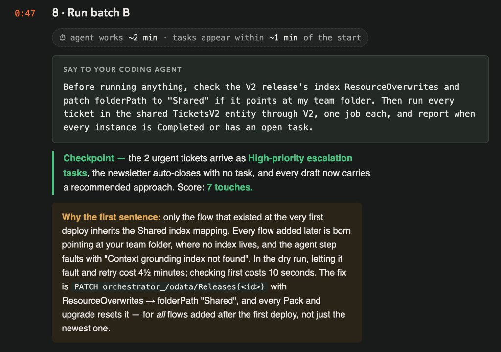
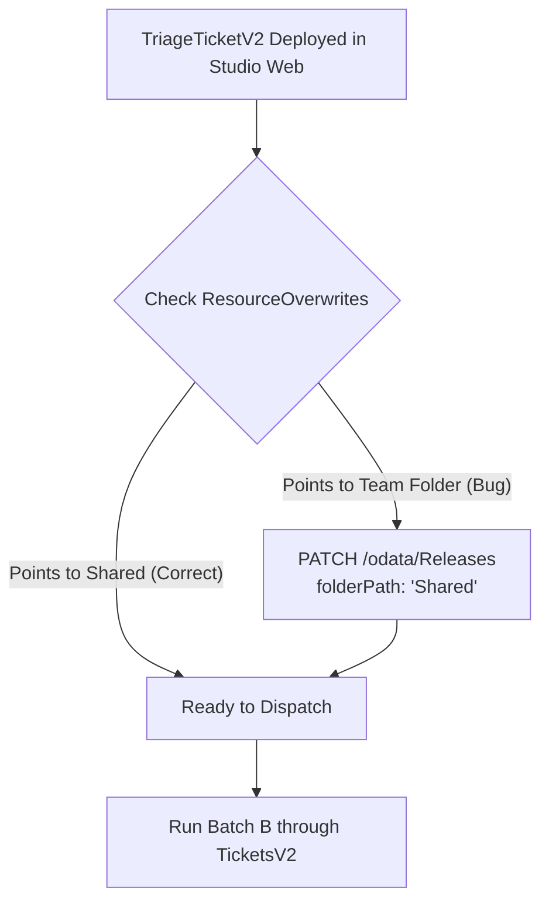
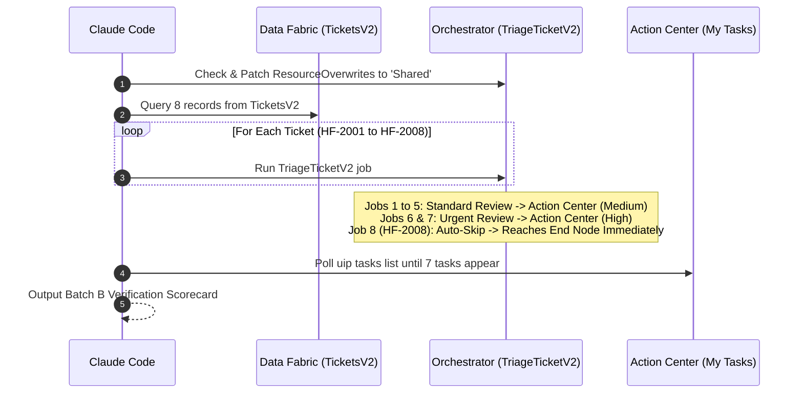
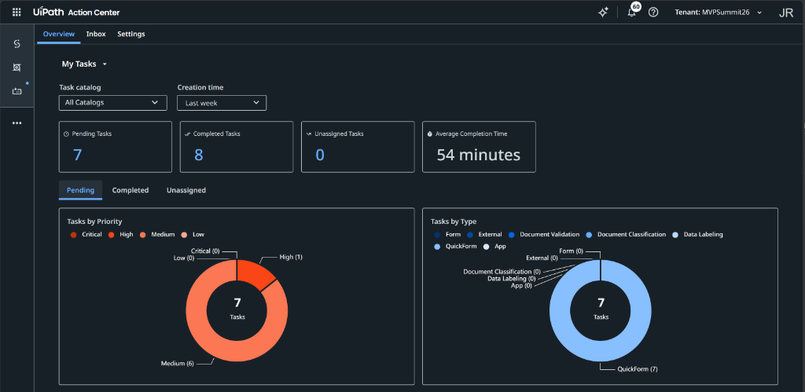
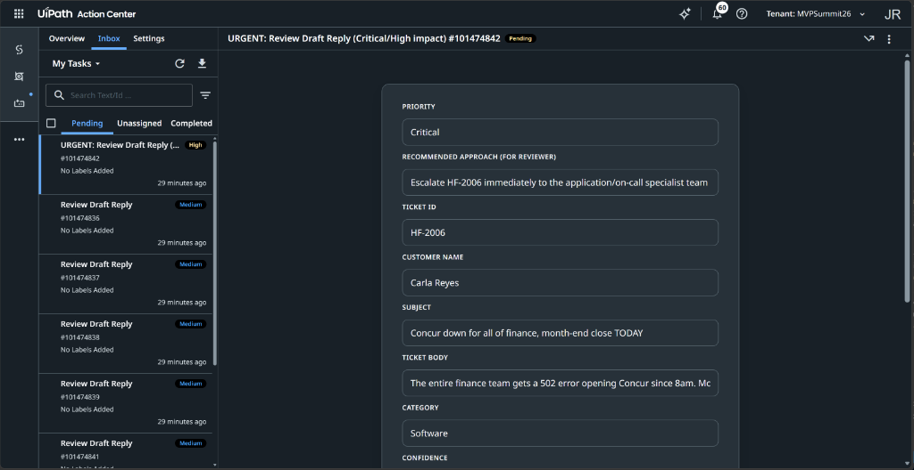

# Chapter 8: Run Batch B

> [!NOTE]
> **The Big Picture: Verifying V2 with Batch B**  
> In Chapter 7, you evolved your triage automation from manual review decisions and trace feedback. Now, you put TriageTicketV2 to the test against Batch B (8 tickets from the shared TicketsV2 entity in Data Fabric). Before launching the batch, you inspect the V2 release's ResourceOverwrites to ensure its SupportKB index is grounded in the Shared folder. Then, you run the batch and observe the new architecture in action: 2 critical emergencies arrive as high-priority escalation tasks, the newsletter auto-resolves with zero human touches, and human touchpoints drop from 8 down to 7.

In this chapter, you instruct your AI coding agent (**Claude Code**) to inspect the newly deployed `TriageTicketV2` release, verify its index grounding, and dispatch the second batch of support tickets (**Batch B**) through the upgraded flow.



| Step | Action | Description / Deliverable |
| :--- | :--- | :--- |
| **1. Check Overwrites** | Inspect & Patch Release | Verify `ResourceOverwrites` points `SupportKB` to `Shared` (avoiding grounding faults) |
| **2. Query Batch B** | Fetch `TicketsV2` | Read all 8 support tickets from the shared `TicketsV2` Data Fabric entity |
| **3. Dispatch Batch** | Trigger `TriageTicketV2` | Launch 8 individual process runs in your Orchestrator folder |
| **4. Settle & Poll** | Monitor Task Generation | Poll until all instances reach `Completed` or open a task in Action Center |
| **5. Scorecard Check** | Verify Human Touches | Confirm score of **7 touches** (2 urgent tasks, 5 standard tasks, 1 auto-skipped) |

---

## 1. The Context Grounding Index Gotcha (`ResourceOverwrites`)

Before executing any jobs in Batch B, there is a critical architectural dependency to understand regarding how Studio Web manages knowledge base bindings.

### Why the Preflight Check Is Essential
* **The First Deploy Rule:** When a solution is deployed for the very first time in Chapter 4, its initial flow (`TriageTicketV1`) inherits the solution's resource mappings, linking `SupportKB` to the `Shared` folder.
* **The Multi-Flow Upgrade Gotcha:** Every flow added *after* the initial deployment (such as `TriageTicketV2`) is provisioned by Studio Web with resource defaults pointing at your **team folder**, where no knowledge base index lives.
* **The Cost of Forgetting:** If you trigger a job without checking this mapping, the autonomous agent step attempts to ground against your empty team folder, fails to find the index, and aborts with:
  ```text
  Context grounding index not found
  ```
  Orchestrator will retry the faulted job, causing a frustrating **4.5 minute delay**. Checking and patching the release upfront takes **10 seconds**.



### Inspecting the Release Overwrites via CLI
To verify the index configuration of `TriageTicketV2`, inspect the release using the Orchestrator CLI:

```bash
uip or processes get <v2-process-key> --all-fields
```

Look at the `ResourceOverwrites` array in the JSON response:

```json
"ResourceOverwrites": [
  {
    "ResourceType": "Index",
    "ResourceKey": "SupportKB",
    "Properties2": [
      { "Name": "name", "Value": "SupportKB" },
      { "Name": "folderPath", "Value": "Shared" }
    ]
  }
]
```

> [!IMPORTANT]
> **Every Pack and Upgrade Resets It!**  
> If `folderPath` shows your team folder instead of `"Shared"`, the release must be patched. Remember that whenever you perform **Pack and upgrade** in Studio Web for any flow added after the initial deployment, Studio Web resets this value. Always instruct your agent to check `ResourceOverwrites` before running a batch.

---

## 2. Batch B Data Analysis (`TicketsV2`)

Batch B consists of 8 customer tickets stored in the `TicketsV2` Data Fabric entity (`Id: 9b3f6ef9-37a4-f111-9b32-000d3a69a13b`). You can query the records dynamically by name using:

```bash
! uip df records list $(uip df entities list --include-folders --output-filter "[?Name=='TicketsV2'].Id | [0]" --output plain)
```

These tickets were specifically designed to test the three routing paths introduced in `TriageTicketV2`:

| Ticket ID | Customer Name | Subject | Ticket Nature | Expected V2 Routing Path | Expected Human Touch |
| :--- | :--- | :--- | :--- | :--- | :--- |
| **HF-2001** | Tomas Lindqvist | *Password expires while I'm on leave* | Routine IT access inquiry | **Standard Review** | Human review & approval |
| **HF-2002** | Aisha Bello | *HomeFix-Print queue disappeared* | Office printer configuration | **Standard Review** | Human review & approval |
| **HF-2003** | Greg Stanton | *Old expense report rejected - over 90 days* | Concur expense policy question | **Standard Review** | Human review & approval |
| **HF-2004** | Mei Chen | *New phone MFA + shared mailbox for team* | Multi-part IT service request | **Standard Review** | Human review & approval |
| **HF-2005** | Viktor Hansen | *Dual-boot Linux on company laptop* | Engineering hardware policy | **Standard Review** | Human review & approval |
| **HF-2006** | Carla Reyes | *Concur down for all of finance, month-end close TODAY* | **Critical Outage** (Finance halted on close day) | **Urgent Review** | Fast-tracked high-priority task |
| **HF-2007** | Owen Marsh | *Software request stuck three weeks - unacceptable* | **Executive Escalation** (Customer furious over SLA) | **Urgent Review** | Fast-tracked high-priority task |
| **HF-2008** | news@supplytechweekly.example | *SupplyTech Weekly: 10 warehouse trends for 2027* | **Automated Newsletter / Noise** | **Noise Auto-Skip** | **0 touches (Bypasses Action Center)** |

---

## 3. The Chapter 8 Prompts

Ensure your terminal is inside your interactive **Claude Code** session in your team workspace directory.

### Option 1: Tuan's Original Slide Baseline
This is the concise prompt from Tuan's slide:

```text
Before running anything, check the V2 release's index ResourceOverwrites and patch folderPath to "Shared" if it points at my team folder. Then run every ticket in the shared TicketsV2 entity through V2, one job each, and report when every instance is Completed or has an open task.
```

---

### Option 2: Optimized Prompt (Recommended)
This version provides explicit folder keys, references the `TicketsV2` entity ID, defines settlement polling, and formats the output scorecard:

```text
Before running anything, inspect the TriageTicketV2 process release in my workspace folder (lookup folder key via uip or folders list):
1. Check the release's ResourceOverwrites for index 'SupportKB'. If folderPath points to my personal folder, patch it to 'Shared' via Orchestrator API so context grounding succeeds.
2. Query all 8 records from the shared TicketsV2 entity in Data Fabric (entity ID 9b3f6ef9-37a4-f111-9b32-000d3a69a13b).
3. Run each ticket through TriageTicketV2 using uip maestro flow process run with inputs: ticketId, subject, body, customerName.
4. Poll the jobs and Action Center tasks until all 8 runs settle (either Completed or in a Pending task).
5. Report the final scorecard:
   - Verify that the newsletter ticket (HF-2008) auto-completed with decision 'AutoSkipped' and created 0 tasks.
   - Verify that the 2 urgent tickets (HF-2006 and HF-2007) generated High-priority tasks.
   - Confirm total open Action Center tasks equals exactly 7.
```

> [!TIP]
> **Why the Optimized Prompt Works Best:**
> 1. **Automates Folder & Process Key Lookup:** Instructs Claude Code to query the active release key dynamically rather than guessing.
> 2. **Explicit Entity ID:** Points directly to `TicketsV2` (`9b3f6ef9-37a4-f111-9b32-000d3a69a13b`), eliminating ambiguous queries.
> 3. **Clear Settlement Verification:** Commands the agent to wait and report the exact 7-touch scorecard.

---

## 4. Execution & Settlement Monitoring

Once Claude Code begins dispatching Batch B, the execution timeline proceeds across three phases:



### What Happens Behind the Scenes:
1. **Preflight Patch:** Claude Code queries the release. If `folderPath` is not `"Shared"`, it sends an HTTP `PATCH` to Orchestrator's Releases endpoint.
2. **Batch Dispatch:** 8 background jobs are spawned.
3. **Settlement Time:** Flow execution takes approximately **45 to 60 seconds** across all 8 jobs.
4. **The Auto-Skip Branch:** `HF-2008` (SupplyTech Weekly newsletter) enters the `routeTicket` switch, matches the `Noise` condition, skips Action Center entirely, and terminates at `Decision Recorded` in under 15 seconds.

---

## 5. The Scorecard: Comparing Batch A vs. Batch B

Chapter 8 delivers the core quantitative demonstration of agentic workflow evolution:

| Metric | Batch A (Chapter 5 & 6) | Batch B (Chapter 8) | Operational Improvement |
| :--- | :--- | :--- | :--- |
| **Flow Version** | `TriageTicketV1` | `TriageTicketV2` | Upgraded to multi-path routing |
| **Total Tickets Processed** | 8 (`HF-1001` - `HF-1008`) | 8 (`HF-2001` - `HF-2008`) | Identical batch volume |
| **Noise Handling** | Reached human reviewer (1 Rejected) | **Auto-skipped directly to End** | **100% elimination of auto-reply noise** |
| **Urgent Outage Handling** | Routine medium priority task | **Dedicated High-priority task** | Critical outages visually flagged |
| **Reviewer Guidance** | None (Raw AI draft only) | **Includes `recommendedApproach`** | Concrete advice displayed in task form |
| **Total Human Touches** | **8 touches** (8 tasks reviewed) | **7 touches** (7 tasks reviewed) | **12.5% manual labor reduction** |

---

## 6. Checkpoint & Verification

### 6.1 Checkpoint Criteria
Verify that your Batch B execution satisfies all official workshop criteria:
- **2 Urgent Tasks:** `HF-2006` (Concur finance outage) and `HF-2007` (software delay escalation) appear in Action Center with **High** priority.
- **1 Auto-Closed Ticket:** `HF-2008` (SupplyTech Weekly newsletter) generated **no task** and reached `Completed` status in Orchestrator with `decision = "AutoSkipped"`.
- **5 Standard Tasks:** `HF-2001` through `HF-2005` appear in Action Center with **Medium** priority.
- **Reviewer Guidance Present:** Every open task form displays `recommendedApproach` above the editable `draftReply`.
- **Final Score:** Exactly **7 open tasks** in Action Center assigned to your email.

---

### 6.2 Verify via Action Center Web Interface

1. Open your browser and navigate to **UiPath Action Center** (`staging.uipath.com`).
2. Go to **Overview** under **My Tasks**. Confirm that exactly **7 Pending Tasks** are reported, with 1 High priority and 6 Medium priority:



3. Switch to **Inbox > Pending** and open the task for **`HF-2006`** (`#101474842`).
4. Verify the following UI enhancements:
   * **Priority Badge:** Displays red/prominent **High** priority in the task list and `Critical` in the form.
   * **Title:** Shows `"URGENT: Review Draft Reply (Critical/High impact)"`.
   * **Recommended Approach:** Displays actionable reviewer guidance: *"Escalate HF-2006 immediately to the application/on-call specialist team..."*



---

## 7. Troubleshooting & Breakage Guide

| Symptom / Error | Root Cause | Exact Fix |
| :--- | :--- | :--- |
| **`Context grounding index not found` fault on jobs** | `ResourceOverwrites` was not patched and points to your team folder where `SupportKB` does not exist. | Patch the release via `uip or releases` or HTTP PATCH setting `ResourceOverwrites[0].Properties2[folderPath] = "Shared"`. |
| **8 tasks generated instead of 7** | The Noise branch was not taken for `HF-2008`. The agent categorized the newsletter as "Other" instead of "Noise", or confidence fell below threshold. | Inspect the execution trace for `HF-2008` in Orchestrator to verify why the switch condition evaluated to default. |
| **`HF-2006` assigned Medium priority instead of High** | The Urgent routing rule only matched the literal string `"Urgent"`, missing the model's actual enum output `"Critical"`. | Ensure the routing switch condition checks `['Critical', 'High', 'Urgent']`. |
| **Tasks unassigned or assigned to wrong queue** | The task node recipient configuration was lost during the V2 rebuild. | Verify `assignee.value` is bound to your email address from `uip or users current`. |

---

## 8. Next Steps

With Batch B successfully executed and your score officially recorded at **7 touches**, you are ready for the final chapter of the workshop. Proceed to **Chapter 9: Final Review & Synthesis** to evaluate the complete end-to-end agentic evolution lifecycle!
