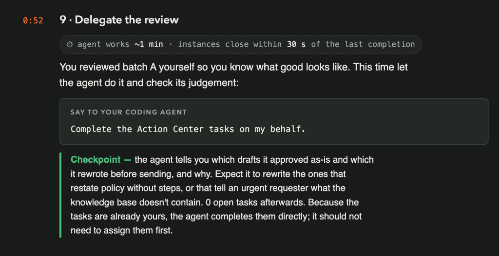
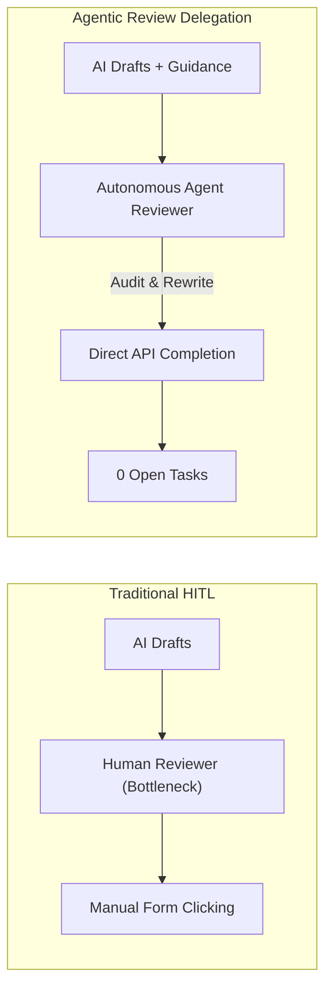
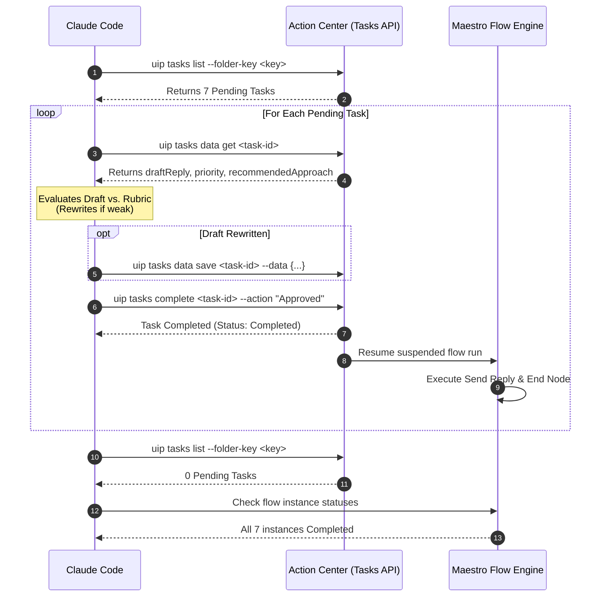
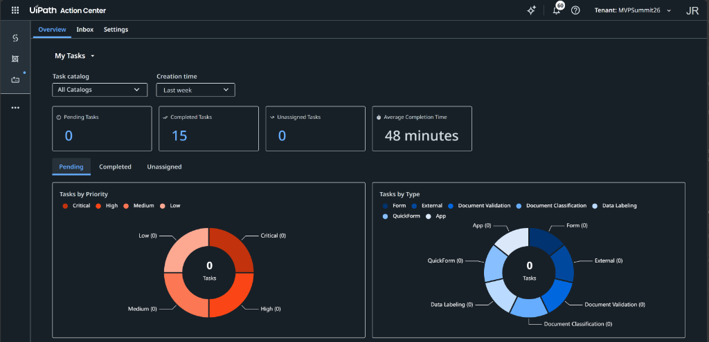
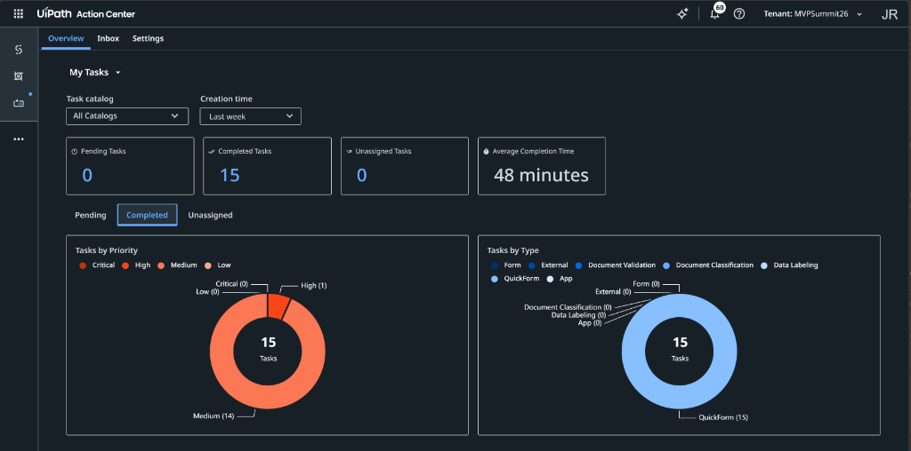
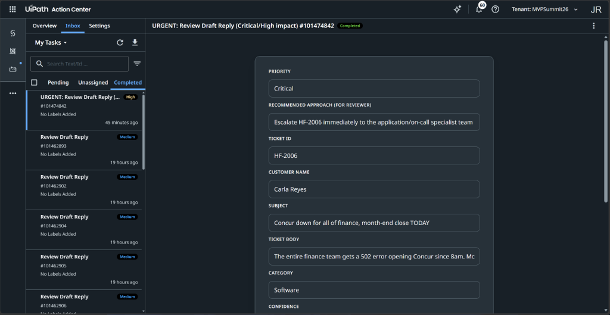

# Chapter 9: Delegate the Review

> [!NOTE]
> **The Big Picture: Delegating Human-in-the-Loop Review to an Autonomous Agent**  
> In Chapter 6, you reviewed Batch A by hand to understand the baseline and learn what good customer triage looks like. In Chapter 8, TriageTicketV2 processed Batch B and produced 7 structured review tasks in Action Center. Now, in Chapter 9, you close the agentic loop by delegating the human review itself to your AI coding agent. Instead of manually clicking through 7 web forms, you instruct Claude Code to act as your surrogate reviewer. The agent inspects each pending task, reads the ticket context and recommended approach, critically evaluates the draft response, rewrites drafts that fail quality criteria (such as echoing policy without actionable steps or telling an urgent user what the knowledge base lacks), and completes the tasks on your behalf.

In this chapter, you instruct your AI coding agent (**Claude Code**) to inspect your pending tasks in **Action Center**, evaluate each draft reply with human-like judgment, rewrite weak replies, and complete the tasks on your behalf.



| Step | Action | Description / Deliverable |
| :--- | :--- | :--- |
| **1. Discover Tasks** | Query Open Tasks | Fetch all pending tasks in your folder via `uip tasks list` |
| **2. Inspect Data** | Read Drafts & Guidance | Retrieve task schema, draft reply, and `recommendedApproach` via `uip tasks data get` |
| **3. Apply Judgment** | Evaluate & Rewrite | Identify drafts that restate policy without steps or expose KB gaps; rewrite them |
| **4. Complete Tasks** | Submit Decisions | Save updated drafts and complete tasks with action `Approved` via `uip tasks complete` |
| **5. Verify Settlement** | Monitor Instances | Confirm **0 open tasks** in Action Center and all flow instances reach `Completed` |

---

## 1. The Human-in-the-Loop Paradigm Shift

In traditional enterprise automation, Human-in-the-Loop (HITL) checkpoints often become an operational bottleneck. When an AI system produces hundreds of drafts daily, human reviewers suffer cognitive fatigue, leading to delayed approvals or rubber-stamping.



### Why Delegate Now?
1. **You Defined Good in Chapter 6:** In Chapter 6, you personally reviewed Batch A, rejected noise, flagged delayed responses, and annotated trace feedback. The criteria for high-quality triage are now firmly established.
2. **Reviewer Guidance Exists in V2:** Because `TriageTicketV2` generates a rich `recommendedApproach` field for every ticket, the surrogate agent is not guessing; it uses the workflow's own operational advice to grade the draft.
3. **Speed & Scalability:** A human reviewer takes 1 to 2 minutes per task (7 to 14 minutes total). An autonomous agent inspects, rewrites, and completes all 7 tasks via API in under 60 seconds.

---

## 2. What Good Judgment Looks Like: The Review Rubric

When Claude Code inspects the 7 open tasks, it must not simply rubber-stamp every draft. It applies a strict quality rubric to determine whether to approve as-is or rewrite:

### Quality Rubric for Draft Review

| Failure Mode | Description | Example from Batch B | Agent Action |
| :--- | :--- | :--- | :--- |
| **Policy Regurgitation** | Restates company policy without providing clear, sequential action steps. | Telling an employee that dual-boot Linux is restricted without explaining how to request an exception or use WSL2. | **Rewrite:** Provide actionable alternatives and step-by-step instructions. |
| **Exposing Internal KB Limitations** | Informs the customer about internal knowledge base gaps or lack of runbooks. | Telling Carla Reyes: *"Our SupportKB does not have a runbook for Concur 502 errors."* | **Rewrite:** Remove internal jargon; project confidence and own the incident escalation. |
| **Tone Inappropriateness** | Bureaucratic or indifferent tone during a business-critical outage. | Using boilerplate greetings when finance is facing a hard 6pm month-end cutoff. | **Rewrite:** Lead with urgent ownership and escalation timelines. |
| **Sound, Grounded Guidance** | Draft directly answers the query, provides accurate policy details, and guides next steps. | Tomas Lindqvist's password reset before annual leave. | **Approve As-Is:** Maintain draft and complete task directly. |

---

## 3. Behind the Scenes: Why Task Assignment Is Not Needed

A common point of confusion in Action Center automation is task assignment:

```text
Do I need to assign the tasks before completing them?
```

### The Action Center Security Model
- In UiPath Action Center, a task can only be transitioned to `Completed` by the user to whom it is actively assigned.
- If a task is in the `Unassigned` pool, attempting to run `uip tasks complete` fails with an authorization error.
- **Why it works seamlessly here:** In Chapter 7, when `TriageTicketV2.flow` was authored, both the `urgentReview` and `standardReview` task nodes configured the assignee dynamically:
  ```json
  "assignee": {
    "value": "user@example.com"
  }
  ```
- Because every task was assigned directly to your email upon creation, the tasks are **already yours**. Claude Code executes commands using your active login profile, meaning it can call `uip tasks complete` immediately without an intermediate `uip tasks assign` call.

---

## 4. The Chapter 9 Prompts

You can execute Chapter 9 using either the baseline prompt from Tuan's slide or the optimized context-rich prompt.

### Option 1: Baseline Prompt (From Tuan's Slide)
This is the concise prompt from Product Manager Tuan's slide:

```text
Complete the Action Center tasks on my behalf.
```

### Option 2: Context-Rich Optimized Prompt (Recommended)
This version provides explicit folder context, defines the quality rubric, specifies task completion parameters, and requests a detailed rationale report:

```text
Complete the Action Center tasks on my behalf in folder "TicketTriage_TEAM<firstname>-<lastname> 6" (folder key ecd0827e-fc8c-49b7-953d-3f05c1661066).

Follow these execution steps:
1. Query all pending tasks in the folder assigned to me using `uip tasks list`.
2. For each task, retrieve its full payload using `uip tasks data get <task-id>`.
3. Evaluate the draft reply against the customer request and the recommendedApproach:
   - Identify drafts that merely restate policy without concrete action steps, or that expose internal knowledge base gaps to the requester.
   - Rewrite any draft failing these quality standards before completing the task.
   - Approve strong, actionable drafts as-is.
4. Save any updated draft back to the task data using `uip tasks data save <task-id>`, then complete the task with action "Approved" using `uip tasks complete <task-id>`.
5. Report back a clear summary table showing:
   - Ticket ID and Task ID
   - Decision (Approved As-Is vs. Rewritten)
   - Specific rationale explaining why any draft was rewritten
   - Verification that exactly 0 open tasks remain in Action Center.
```

---

## 5. Execution Sequence & Flow Resumption

When Claude Code executes the prompt, the interaction proceeds across Orchestrator, Action Center, and the underlying Maestro flow instances:



### Instant Flow Resumption
Once a task is marked `Completed` in Action Center, the Maestro engine automatically catches the completion event, un-suspends the waiting job, executes the final End node, and marks the instance as **`Completed`**. This typically settles within **30 seconds** of the last task completion.

---

## 6. Checkpoint & Verification

### 6.1 Checkpoint Criteria
Verify that your execution meets all official workshop criteria:
- **Quality Judgement Report:** The agent provides an explicit summary naming which drafts were approved as-is and which were rewritten, citing clear reasons.
- **Rewritten Drafts:** The agent rewrote drafts that merely restated policy without steps or told an urgent user what the KB lacked.
- **0 Open Tasks:** Running `uip tasks list` returns 0 pending tasks.
- **All Instances Completed:** All 7 previously suspended flow instances in Orchestrator have transitioned from `Running`/`Suspended` to **`Completed`**.

---

### 6.2 Verify via Action Center Web Interface

1. Open your browser and navigate to **UiPath Action Center** (`staging.uipath.com`).
2. Go to **Overview** under **My Tasks**:
   * Confirm **Pending Tasks** now displays **0** (with 0 tasks across all priority bands in the Pending donut chart):



   * Switch to the **Completed** sub-tab to confirm **Completed Tasks: 15** (8 from Batch A + 7 from Batch B), showing **1 High** and **14 Medium** in the breakdown:



3. Switch to **Inbox > Completed**:
   * Open **`HF-2006`** (`#101474842`) and verify that it shows the green **Completed** status with all field data saved:




---

## 7. Troubleshooting & Breakage Guide

| Symptom / Error | Root Cause | Exact Fix |
| :--- | :--- | :--- |
| **`Task is not assigned to current user` (HTTP 400)** | The task was unassigned or assigned to a different user, preventing direct completion. | Run `uip tasks assign --id <task-id> --user-email <email>` before completing, or verify assignee binding in the flow. |
| **Agent rubber-stamps all 7 drafts without rewriting** | The prompt did not instruct the agent to evaluate quality or look for policy regurgitation / KB gap disclosures. | Use the Optimized Prompt (Option 2) with explicit rubric evaluation instructions. |
| **Tasks complete but flow instances remain `Suspended`** | Maestro event listener delay or action name mismatch in the task node. | Wait 30 seconds for event settlement. Verify the task completion action matches the expected transition (e.g. `"Approved"`). |
| **`uip tasks complete` fails with unknown option** | Parameter syntax error in the CLI call (e.g. putting positional `<task-id>` incorrectly). | Pass `<task-id>` as the first positional argument: `uip tasks complete <task-id> --folder-key <key>`. |

---

## 8. Summary: The Complete Agentic Lifecycle

Chapter 9 concludes the complete progression of agentic workflow evolution:

1. **Chapter 3 to 5:** You built a simple, naive baseline (V1) that treated every ticket identically.
2. **Chapter 6:** You experienced the real-world operational gaps first-hand and logged observability feedback.
3. **Chapter 7:** You let an AI agent mine that feedback to architect a multi-path intelligent routing flow (V2).
4. **Chapter 8:** You proved quantifiable business value: cutting human touches from 8 to 7 and isolating emergencies.
5. **Chapter 9:** You elevated human-in-the-loop oversight from tedious manual review to high-level agentic delegation.
